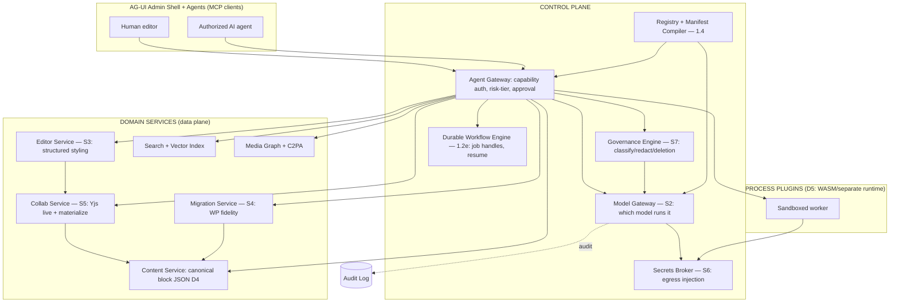
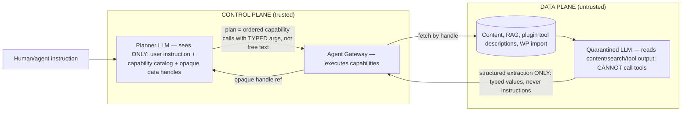
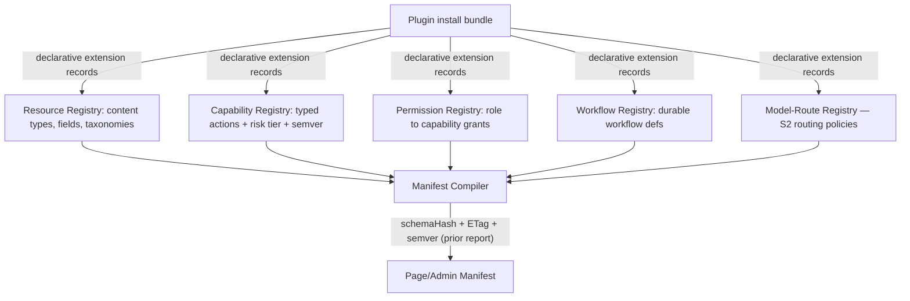

# Agent-Native CMS — Integrating Architecture & Six Deferred Subsystems (Extension Report)

This report **extends** the prior control-plane report (capability-contract JSON schema, agent-gateway pseudocode, risk-tier table, manifest versioning with schemaHash+ETags+semver, AG-UI interrupt/resume approval lifecycle). It does **not** regenerate that work. Upstream Decisions D1–D8 are treated as settled inputs and referenced by ID. Where evidence is thin or forward-looking, claims are flagged "unverified — follow-up."

---

## TL;DR
- Adopt a **two-gateway split**: the existing agent gateway decides *what* may be done; a new **model gateway** — recommended build: self-hosted **LiteLLM proxy** ("a single, unified interface to call 100+ LLMs … using the OpenAI format," per docs.litellm.ai) wrapped in our own TypeScript policy/capability-matrix layer — decides *which* model runs it, and never lets an incapable model silently drop a structured tool call. The async substrate is a **durable-workflow engine (Temporal-style)**, justified over saga/event-sourcing for D1/D2.
- The three problems models hand-wave are solvable with named primitives: **trust boundary** via a CaMeL/dual-LLM control-vs-data-plane split where untrusted strings can never become tool calls; **concurrency** via Yjs CRDT ("the fastest CRDT implementation by far," docs.yjs.dev) with origin-scoped `Y.UndoManager` for per-agent reversibility (D4 validated); **PII round-trip** via Presidio's `InstanceCounterAnonymizer`/`InstanceCounterDeanonymizer` (`entity_counter` operator) placeholder pairing, plus NIST **FF1** format-preserving encryption for values that must keep their shape.
- WordPress migration is a first-class subsystem with **fidelity tiers (lossless / lossy-with-report / manual-required)**, a plugin-extensible mapping registry, and mandatory dry-run diff before commit; page-builder blobs (Elementor `_elementor_data` JSON, Divi/WPBakery shortcodes) are quarantined with original bytes preserved, never silently dropped.

---

# SECTION 1 — Integrating Architecture & Cross-Cutting Contracts

## 1.1 System Topology



### Per-subsystem interface contracts (interface only; internals in §§2–7)

| Subsystem | Inputs | Outputs | Events emitted | Failure modes |
|---|---|---|---|---|
| **Model Gateway (S2)** | Normalized completion request + task-tier + tenant-policy ref | Normalized completion response; structured-API success flag | `model.call.completed`, `model.budget.exceeded`, `model.fallback.triggered` | Provider outage → fallback chain; budget kill → 402-style refusal; incapable-model → refuse before call |
| **AI Editor (S3)** | Editor context manifest (selection, AST, tokens) + NL instruction | Ordered `EditorCommand[]` / AST patch (proposed, not applied) | `content.edit.proposed`, `content.style.applied` | No-token-mapping → refuse/nearest/escalate; invalid command → reject transaction |
| **Collab Service (S5)** | EditTransaction (agent or human) against live Yjs doc | Merged CRDT state; materialized canonical JSON on save | `content.presence.updated`, `content.conflict.detected`, `content.materialized` | Conflict beyond policy → escalate to human; materialize-validation fail → block save |
| **Migration Service (S4)** | WXR / WP-REST payload + ContentTypeMapping registry | MigrationPlan, FidelityReport, mapped block JSON | `migration.item.classified`, `migration.item.quarantined`, `migration.committed` | Unmappable → quarantine; render-equivalence fail → flag lossy |
| **Secrets Broker (S6)** | SecretReference (handle, never value) + capability context | Injected credential at network egress only | `secret.accessed` (handle only) | Reference unresolved → fail capability; scope violation → deny |
| **Governance Engine (S7)** | Field + classification; content bound for a provider | Redacted payload + rehydration map; deletion plan | `pii.redacted`, `pii.rehydrated`, `data.deletion.propagated` | Un-restorable token → escalate; provider-policy violation → block call |

## 1.2 Cross-Cutting Contracts

### (a) Extended Audit Envelope

```typescript
interface AuditEnvelope {
  auditId: string;              // ULID
  tenantId: string;
  timestamp: string;            // RFC3339
  actor: { type: "human" | "agent" | "system"; id: string; sessionId: string };
  capability: { id: string; version: string; riskTier: 1|2|3|4 };
  idempotencyKey?: string;      // links to dedup store (1.2d)
  workflowRunId?: string;       // links to durable engine (1.2e)
  // --- extension: model calls ---
  modelCall?: {
    routeId: string; resolvedProvider: string; resolvedModel: string;
    promptTokens: number; completionTokens: number; costUsd: number;
    structuredApiRequested: boolean; structuredApiSucceeded: boolean;
    fallbackChain?: string[];   // models tried in order
    redactionApplied: boolean;  // SEC 7 cross-ref
  };
  // --- extension: secret access (NEVER the value) ---
  secretAccess?: {
    secretRef: string;          // handle only
    scope: string; purpose: string;
    injectedAtEgress: boolean;  // true = plaintext never entered agent/model ctx
  };
  // --- extension: migration steps ---
  migrationStep?: {
    planId: string; itemId: string; sourceType: string; targetType: string;
    fidelityTier: "lossless" | "lossy" | "manual"; dryRun: boolean;
  };
  outcome: "success" | "rejected" | "escalated" | "error";
  redactionRule: string;        // which redaction profile applied to THIS envelope
}
```
The envelope is itself subject to the §6 redaction rule — secret values, raw PII, and provider keys are never written into it.

### (b) Event Taxonomy (AsyncAPI 3.0)

AsyncAPI is "a project used to describe message-driven APIs in a machine-readable format … protocol-agnostic" (asyncapi.com). Channels group by domain; messages reference reusable JSON-Schema payloads in `components`.

```yaml
asyncapi: 3.0.0
info: { title: Agent-Native CMS Event Bus, version: 1.0.0 }
channels:
  content:
    address: content.events
    messages:
      ContentEdited:        { $ref: '#/components/messages/ContentEdited' }
      ContentMaterialized:  { $ref: '#/components/messages/ContentMaterialized' }
      ConflictDetected:     { $ref: '#/components/messages/ConflictDetected' }
  workflow:
    address: workflow.events
    messages:
      JobStarted:           { $ref: '#/components/messages/JobStarted' }
      JobResumed:           { $ref: '#/components/messages/JobResumed' }
      ApprovalRequested:    { $ref: '#/components/messages/ApprovalRequested' }
  model:
    address: model.events
    messages:
      ModelCallCompleted:   { $ref: '#/components/messages/ModelCallCompleted' }
      BudgetExceeded:       { $ref: '#/components/messages/BudgetExceeded' }
      FallbackTriggered:    { $ref: '#/components/messages/FallbackTriggered' }
  security:
    address: security.events
    messages:
      SecretAccessed:       { $ref: '#/components/messages/SecretAccessed' }
      PiiRedacted:          { $ref: '#/components/messages/PiiRedacted' }
      DeletionPropagated:   { $ref: '#/components/messages/DeletionPropagated' }
      CapabilityDeprecated: { $ref: '#/components/messages/CapabilityDeprecated' }
```
Every payload carries `tenantId`, `auditId`, `schemaVersion`. Security events never carry secret values or raw PII (§6/§7 redaction rule).

### (c) Capability Versioning + Deprecation Policy
- **Semver per capability.** `MAJOR` = breaking input/output contract; `MINOR` = additive (optional fields, safe-default enum values); `PATCH` = non-contract fixes.
- **Deprecation window.** When `v2` ships, `v1` enters `DEPRECATED` with a tenant-configurable sunset (default 180 days). The manifest compiler (§1.4) keeps both registered; a `CapabilityDeprecated` event fires on every post-deprecation `v1` invocation with `Sunset`-header semantics.
- **A v1-bound agent when v2 ships:** the agent's MCP tool wrapper is pinned to `v1` by `schemaHash` (prior report). It keeps resolving `v1` until sunset; on sunset, `v1` returns a structured `CapabilityGone` error forcing manifest re-discovery (schemaHash refresh). MINOR/PATCH bumps never break a v1-pinned agent because they are non-breaking by definition.

```typescript
interface CapabilityVersionPolicy {
  capabilityId: string;
  current: string;                 // "2.1.0"
  supported: { version: string; state: "active"|"deprecated"|"gone"; sunsetAt?: string }[];
  migrationHintUrl?: string;
}
```

### (d) Idempotency Design (in full)
Agents and durable retries can deliver the same write twice; every write capability is made idempotent.

**Dedup store** — keyspace keyed by `(tenantId, capabilityId, idempotencyKey)` (Postgres table `idempotency_keys`, or Redis with persistence).
```typescript
interface IdempotencyRecord {
  key: string;                 // derived (below)
  tenantId: string;
  capabilityId: string;
  requestHash: string;         // sha256 of canonicalized request body
  status: "in_progress" | "completed" | "failed";
  responseSnapshot?: string;   // stored result for replay
  createdAt: string;
  ttlExpiresAt: string;        // 24h tier-1/2; 7d tier-3/4
  lockToken: string;
}
```
**Key derivation.** Client-supplied `Idempotency-Key` (UUID) preferred; if absent, gateway derives `sha256(tenantId | actorId | capabilityId | canonicalJSON(args) | coarseTimeBucket)`. Client keys are **mandatory** for tier-3/4 (destructive) capabilities so a retry-after-timeout is unambiguous.
**TTL.** 24h default; 7d for high-risk writes so a slow human approval cycle still dedups.
**Retry-after-partial-failure semantics:**
1. First request inserts `in_progress` with `requestHash` (atomic `INSERT … ON CONFLICT DO NOTHING`).
2. Insert wins → execute; on success store `responseSnapshot`, set `completed`.
3. Insert loses, existing `completed`, `requestHash` matches → return stored snapshot (no re-execution).
4. Existing `completed`, `requestHash` differs → `409 IdempotencyKeyReuseConflict`.
5. Existing `in_progress` → `Retry-After`; the durable workflow (1.2e) owns final reconciliation so a crashed holder's lock expires and the workflow resumes exactly-once at the business level.

This mirrors Temporal's guidance that "Activities are at-least-once and may re-run even after 'success' if a worker crashes before completion is recorded" (temporal.io) — so dedup store + workflow gives effective exactly-once business effect.

### (e) Async / Long-Running Task Substrate — **DECISION: durable-workflow (Temporal-style)**
Options weighed: command-pattern, event-sourcing, saga, durable-workflow.

**Recommendation: durable-workflow engine.** Justification under D1/D2:
- Temporal "uses durable event sourcing combined with idempotent execution. Workflow actions and decisions are logged durably, allowing Temporal to replay events to reach the exact state before failures" (temporal.io) → direct **resumability when the client disconnects mid-run**: the agent/AG-UI session can drop and the workflow continues server-side; on reconnect the client re-attaches via `workflowRunId`.
- The **Workflow ID acts as an idempotency key** — "the Server will return a duplicate error instead of creating the second Workflow" (temporal.io) — composing cleanly with §1.2d.
- **Saga compensation** is available *inside* a workflow for multi-service writes (e.g., a migration commit touching content + search + media) — saga semantics without hand-rolling "a distributed asynchronous event-driven bespoke system" (temporal.io).
- The prior report's AG-UI interrupt/resume maps to a Temporal **signal** (human approval) that unblocks a waiting workflow.

**D1/D2 caveat:** Temporal is operationally heavy for the single-tenant self-host default. Mitigation: ship an embedded Postgres-backed runner implementing the identical `JobHandle` contract for single-tenant; allow Temporal as the managed-SaaS multi-tenant target. The contract is swappable either way:
```typescript
interface JobHandle {
  workflowRunId: string; tenantId: string; capabilityId: string;
  status: "running" | "waiting_approval" | "completed" | "compensating" | "failed";
  resumeToken: string;          // client re-attaches after disconnect
  signalUrl: string;            // AG-UI posts approval/cancel here
  progress?: { step: string; pct: number };
}
```

## 1.3 Trust Boundaries — Data Plane vs Control Plane (fully built out)

**The core threat.** LLMs cannot structurally separate instructions from data: a system prompt, a user message, a retrieved RAG chunk, and an injected malicious instruction "all appear as natural language text in the same context window" (dev.to). NVIDIA states the root cause plainly: "contrary to standard security best practices, 'control' and 'data' planes are not separable when working with LLMs. A single prompt contains both control and data" (developer.nvidia.com). Prompt injection is **OWASP LLM01** (#1 in the OWASP Top 10 for LLM Applications). Therefore the **architecture — not a content filter** — must guarantee that untrusted inputs can never become control signals.

**Untrusted inputs here:** (1) page/post content; (2) plugin metadata and **MCP tool descriptions** (attacker-controlled text); (3) search/RAG chunks; (4) WordPress import payloads; (5) model output on the return path.

**Design: CaMeL-style capability/dual-plane separation**, after Google DeepMind's CaMeL — which "explicitly extracts the control and data flows from the (trusted) query; therefore, the untrusted data retrieved by the LLM can never impact the program flow" (arXiv 2503.18813) — and Simon Willison's dual-LLM pattern.



**Mechanisms enforcing the boundary:**
1. **Planner never sees raw untrusted content.** It sees the instruction, *handles* (e.g. `doc://block/abc`), and the typed capability catalog. It emits a **plan of typed capability calls**, not prose that gets re-parsed.
2. **Untrusted content is processed only by the Quarantined LLM**, which has **no tool access** and whose output is JSON-Schema-constrained (typed values). An extracted value can become a *string argument* but can never *select* a capability or alter the plan — the CaMeL invariant.
3. **Plugin tool descriptions are data, not control.** They reach the Planner only after the manifest compiler (§1.4) escapes/length-bounds them and binds each tool to a registered capability with a fixed typed contract, presented as a structured catalog entry with provenance `source: plugin:<id>` — never concatenated into the Planner's instruction channel.
4. **Action screening / least privilege.** Each proposed call is checked against the *original user intent* and the agent's granted capability set (risk-tier table). A drifted call (e.g., agent now wants `secrets.read`) is refused regardless of how persuasive the intermediate content was. OWASP is explicit that input filtering "can't solve this problem in isolation."
5. **Output screening on the return path.** Model output is re-scanned (PII re-redaction §7; injection markers) before render or downstream-tool use.

**Why this is a real design, not a checklist:** the security property ("untrusted text cannot alter control flow") is provided by the *topology* — separate models, typed plan, no tool access in the data plane — so even a 100%-successful injection in content can at most produce a wrong *typed value* that still flows through capability authorization, approval, and audit. It cannot escalate privilege or invent a new action.

## 1.4 Registry Map & Plugin Extension at Install Time


A plugin ships a **signed declarative manifest** (not platform-mutating code). At install the platform validates it and writes extension records: new content types/fields → Resource Registry; new capabilities (typed JSON-Schema args, risk tier, semver; executors run **out-of-process** per D5) → Capability Registry; default role grants (admin-approved) → Permission Registry; optional durable workflows → Workflow Registry; optional route hints (e.g., "needs vision") → Model-Route Registry. The **manifest compiler recompiles** the page/admin manifest, bumping `schemaHash`/`semver`/`ETag`; agents detect the new hash and re-discover. **No platform redeploy** because registries are data and executors are sandboxed workers. Tool descriptions are bound here as *data* (§1.3.3).

---

# SECTION 2 — Model Gateway / Multi-LLM Routing

Separate from the agent gateway: the agent gateway authorized the *action*; the model gateway picks the *model* and runs the completion.

## 2.1 Build vs Adopt — **DECISION: adopt LiteLLM proxy as substrate, wrap in our TS policy layer**

| Option | Fit under D1 (self-host-first) / D7 (multi-LLM, BYO-key) | Verdict |
|---|---|---|
| **LiteLLM (BerriAI) self-hosted proxy** | Open-source, self-hostable; per docs.litellm.ai a "single, unified interface to call 100+ LLMs … using the OpenAI format" (the Promptfoo provider page cites "access to 400+ LLMs through a unified OpenAI-compatible interface"); built-in **virtual keys, per-key/team budgets, routing & fallbacks**, cost tracking to Postgres; maps all provider errors to OpenAI exception types | **Recommended substrate** |
| OpenRouter (hosted) | Strong routing (`require_parameters`, `zdr` flag, model-fallback array, provider `order`/`only`/`ignore`), but **hosted** — conflicts with self-host-first; keep as an *optional provider* behind LiteLLM | Optional backend |
| Vercel AI SDK | Great TS DX, typed tool calling, `generateObject` schema enforcement; a client library, not a budgeted multi-tenant proxy | Use in app layer |
| DIY adapter | Full control, re-implements budgets/fallbacks/cost from scratch | Reject |

We wrap LiteLLM with a TS **policy + capability-matrix layer** because LiteLLM's `drop_params: true` *silently strips unsupported fields* — exactly the silent-tool-call-failure trap we must instead **detect and refuse**.

## 2.2 Model Capability Matrix + Refusing/Detecting Incapable Models

```typescript
interface ModelCapability {
  modelId: string;
  toolCalling: "native-strict" | "native" | "emulated" | "none";
  jsonMode: "strict-schema" | "json-object" | "none";
  jsonModeReliability: number;     // 0-1, measured by eval harness (2.7)
  vision: boolean;
  systemPrompt: "native" | "prepend-user" | "none";
  contextWindow: number;
  streaming: boolean;
  zdrAvailable: boolean;
}
```
**Refusing structured-capability calls to incapable models:** before routing, the policy layer checks the capability's requirements against `ModelCapability`. If a tier-3 write requires `toolCalling: native-strict` and the candidate is `emulated`/`none`, the router **refuses that model** and either falls back or returns `NoCapableModel`. This mirrors OpenRouter's `require_parameters` ("OpenRouter will not fallback to a provider that would ignore these parameters," deepwiki.com) — but enforced *before* the call.

**Detecting silent tool-call failure:** even a capable model may return prose instead of the requested tool call. The wrapper runs **post-call structural validation** asserting the response contains a tool call matching the schema. If not, record `structuredApiSucceeded:false`, do NOT apply the (nonexistent) action, and trigger fallback. Vercel documents that native strict mode "guarantees that tool call inputs match your schema exactly" but "Not all providers support strict mode. For those that don't, the option is ignored" (vercel-ai.mintlify.app) — so we cannot trust the provider and must validate ourselves.

## 2.3 Routing Policy

```typescript
interface ModelRoute {
  routeId: string;
  taskTier: "draft-assist" | "bulk-batch" | "high-stakes-edit" | "migration-classify";
  candidates: { modelId: string; priority: number }[]; // ordered fallback chain
  requires: Partial<Pick<ModelCapability,"toolCalling"|"jsonMode"|"vision"|"contextWindow">>;
  tenantPolicyRef: string;         // allowed providers, residency, ZDR (SEC 7)
  costCeilingUsd: number;          // per-call hard cap
  dataResidency?: "eu" | "us" | "any";
  promptCaching: boolean;
}
```
Routing decision = (task-tier requirements) ∩ (tenant ProviderDataPolicy §7) ∩ (budget remaining §2.5) ∩ (capability matrix §2.2), then highest-priority surviving candidate. LiteLLM supports `routing_strategy` (`latency-based-routing`, `usage-based-routing`) and `enable_pre_call_checks` ("Before call is made check if a call is within model context window," docs.litellm.ai) for the context-window guard.

## 2.4 Fallback, Retries, Prompt Caching, Graceful Degradation
- **Fallback chains:** ordered `candidates`. LiteLLM router `fallbacks` + `num_retries`; OpenRouter's `models[]` array does the same at provider level ("If the first model returns an error, OpenRouter will automatically try the next model in the list," openrouter.ai). `content_policy_fallbacks` handles moderation refusals.
- **Cooldowns:** LiteLLM `allowed_fails` / `cooldown_time` removes a flapping model ("cooldown model if it fails > 1 call in a minute").
- **Prompt caching:** per-route (e.g., Anthropic prompt caching via `providerOptions`); cuts cost on repeated editor context manifests (§3).
- **Graceful degradation:** if ALL models in a route are down or budget-killed, **agent features degrade but the admin shell does not** — AG-UI surfaces "AI assist unavailable" and every capability remains human-executable (D6 parity floor). The CMS never hard-depends on a reachable model.

## 2.5 Budget Governance + Two Distinct Kill-Switches

```typescript
interface BudgetPolicy {
  scope: "tenant" | "agent" | "task";
  scopeId: string;
  maxBudgetUsd: number;
  windows: { period: "1d"|"30d"; capUsd: number }[]; // LiteLLM budget windows
  softAlertPct: number;            // e.g. 60 → warn
  hardStop: boolean;               // at 100% → SPEND kill-switch
}
```
LiteLLM enforces virtual-key budgets ("we expect the second request to fail since we cross the budget for gpt-4o on the Virtual Key," docs.litellm.ai). We layer escalation at 60% (warn) → 85% (escalate) → 100% (hard cap).

**Two kill-switches, deliberately distinct, both surfaced in AG-UI:**
- **Spend kill-switch:** trips on budget exceeded; stops *paid model calls* only — human admin work continues, cheaper/local fallback may still serve.
- **Safety kill-switch (prior report):** trips on policy/risk violation; stops *agent actions entirely* regardless of budget.

They are independent so a spend cap is not mistaken for a safety incident and a safety halt is not bypassed by "budget is fine." **Caveat:** LiteLLM has a documented bug where budget checks can use stale Redis spend while management APIs show spend below cap (GitHub issue #27735) — the spend kill-switch must reconcile against the DB before a hard stop, not trust the cache alone.

## 2.6 Embedding-Model Management (D7: pinned per tenant)

```typescript
interface EmbeddingConfig {
  tenantId: string;
  embeddingModelId: string;        // PINNED per tenant (D7)
  dimensions: number;
  vectorIndexRef: string;          // pgvector table / collection
  reembedOnSwitch: "required";
}
```
A tenant's vectors are comparable only if produced by one model, so the model is pinned. Switching requires **re-embedding the whole corpus** (a batch durable workflow §1.2e); old vectors are tombstoned (not deleted in place) until the new index validates — same lineage discipline as §7 deletion. After a content edit or a CRDT rollback (§5), affected chunks are re-embedded and pgvector rows upserted by `chunkId`.

## 2.7 Normalized Envelopes + route-and-execute + eval harness

```typescript
interface CompletionRequest {
  routeId: string; tenantId: string; capabilityId: string;
  messages: { role: "system"|"user"|"assistant"; content: string }[];
  tools?: ToolSchema[]; responseSchema?: JSONSchema;
  requireStructured: boolean; idempotencyKey?: string;
}
interface CompletionResponse {
  modelUsed: string; text?: string; toolCalls?: ToolCall[];
  structuredApiSucceeded: boolean;
  usage: { promptTokens: number; completionTokens: number; costUsd: number };
  fallbackChain: string[];
}
```
```text
function routeAndExecute(req):
  policy   = tenantPolicy(req.tenantId)                       # SEC 7 provider policy
  route    = routeRegistry.get(req.routeId)
  redacted = governance.redact(req.messages, policy)          # SEC 7 round-trip (pre)
  candidates = route.candidates
      .filter(m => capabilityMatrix.satisfies(m, route.requires))   # 2.2 refuse incapable
      .filter(m => policy.allows(provider(m)) && residencyOK(m))    # SEC 7
  if candidates.empty: return Refuse("NoCapableModel")
  if budget.killed(req.tenantId, req.capabilityId): return Refuse("SpendKillSwitch")  # 2.5
  for m in candidates (by priority):
     if budget.remaining(scope) < route.costCeilingUsd: continue
     resp = litellm.call(m, redacted, req.tools, req.responseSchema)
     if req.requireStructured and not validateStructured(resp, req.responseSchema):  # 2.2 silent-failure detect
        audit(structuredApiSucceeded=false, model=m); continue                       # fallback
     out = governance.rehydrate(resp, redactionMap)           # SEC 7 round-trip (post)
     audit(AuditEnvelope.modelCall{...})                      # 1.2a
     return out
  return Refuse("AllModelsFailed")    # graceful degradation 2.4 — admin still human-usable
```
**Eval-harness integration:** every benchmark runs across **N models** and reports, per model, the **structured-API ratio** (`succeeded/total`) and **silent-failure rate** (`requireStructured && !succeeded / total`), plus cost and latency. These feed `jsonModeReliability` (§2.2) so routing self-corrects: a model whose silent-failure rate rises gets demoted.

---

# SECTION 3 — AI Editor & Structured Styling

## 3.1 Editor Engine — **DECISION: TipTap (ProseMirror); canonical store = Portable-Text-style block JSON (D4)**

| Engine | Transactional command API | Maps to block JSON | Yjs/CRDT (S5) | Verdict |
|---|---|---|---|---|
| **TipTap / ProseMirror** | "ProseMirror works with a strict Schema … Commands change that document programmatically … Changes are applied as transactions to the state" (tiptap.dev) | Clean: nodes/marks ↔ Portable Text blocks/spans/marks | `y-prosemirror` "exports ProseMirror plugins that make any ProseMirror-based editor collaborative … ensures the document still conforms to the specified schema" (docs.yjs.dev) | **Recommended** |
| Lexical | Node API, command dispatch, immutable state | Own node tree → serialize | Its Yjs integration "hardcodes the name of the root node, making it impossible to have more than one Lexical editor per Yjs document" (liveblocks.io) | Reject for multi-doc |
| Slate | Custom model | Build everything | — | Reject |

ProseMirror's transactional **step** model is exactly right: AI edits become invertible (undo), diffable, auditable steps. Portable Text is "a JSON based rich text specification" where a block has `style`, `children` (spans), and `markDefs` (annotations) (github.com/portabletext) — ProseMirror nodes/marks map directly, and Sanity's standalone `@portabletext/editor` shares this lineage.

## 3.2 Two Styling Layers (AI cannot invent inline CSS)
**(a) Semantic styling** ("warning callout", "emphasize this") maps to **theme component variants / design tokens** — AI may only choose from a registered set.
```typescript
interface StyleToken {
  tokenId: string;                 // "callout.warning"
  kind: "block-variant" | "mark" | "spacing" | "color-role";
  appliesTo: ("block"|"span")[];
  themeBinding: string;            // resolved by theme at render; AI never sees CSS
  description: string;             // for the model's context manifest
}
```
**(b) Raw formatting** (bold/italic/headings) maps to **AST marks/styles** (Portable Text decorators `strong`, `em`; block `style: h2`).

**When a requested style has no token:** **nearest** (propose a registered token within a semantic-similarity threshold, labeled "approximate"); **refuse** (`NoTokenMapping`, surface available tokens); **escalate** (create a `TokenRequest` for a human theme-owner). The bound holds: **AI styling output is always a token reference or a refusal, never arbitrary CSS.**

## 3.3 Editor Context Manifest (per request)
```typescript
interface EditorContextManifest {
  selection: { blockKey: string; from: number; to: number; relativePos: string }; // CRDT-relative
  surroundingAst: PortableTextBlock[];   // bounded window around selection
  availableMarks: string[];              // ["strong","em","code"]
  availableTokens: StyleToken[];         // the ONLY styling vocabulary
  constraints: { maxBlocks: number; allowNewBlocks: boolean; readonlyRanges: string[] };
  schemaHash: string;                    // ties to manifest versioning (prior report)
}
```
The model receives only this — never the raw DOM or CSS.

## 3.4 StylingCapability Contract (extends prior capability-contract schema)
```typescript
interface StylingCapability /* extends CapabilityContract */ {
  capabilityId: "content.style.apply";
  version: "1.0.0"; riskTier: 2;
  input: { docId: string; contextManifest: EditorContextManifest; instruction: string };
  output: { commands: EditorCommand[] };  // PROPOSED, flows through approval
  approvalRequired: true;                  // streamed diff, not live mutation
}
interface EditorCommand {
  op: "setMark" | "removeMark" | "setBlockStyle" | "setBlockVariant" | "insertBlock" | "wrapInVariant";
  target: { blockKey: string; from?: number; to?: number };  // CRDT-relative positions
  value: { mark?: string; token?: string };  // token only — never raw style
  rationale: string;
}
```

## 3.5 NL → ordered command sequence (worked example)
Instruction: **"turn this into a callout and bold the key sentence"** on paragraph `b7` whose sentence "Back up your data first." spans offsets 0–24.
```json
[
  { "op": "wrapInVariant", "target": { "blockKey": "b7" },
    "value": { "token": "callout.warning" }, "rationale": "‘callout’ → registered warning variant" },
  { "op": "setMark", "target": { "blockKey": "b7", "from": 0, "to": 24 },
    "value": { "mark": "strong" }, "rationale": "‘bold the key sentence’ → strong decorator" }
]
```
AST diff (streamed for approval):
```diff
- { "_type":"block","style":"normal","children":[{"_type":"span","text":"Back up your data first. ...","marks":[]}] }
+ { "_type":"block","style":"normal","_variant":"callout.warning",
+   "children":[{"_type":"span","text":"Back up your data first.","marks":["strong"]},
+               {"_type":"span","text":" ...","marks":[]}] }
```
Previewable, undoable (each command = an invertible ProseMirror step), audited. Commands apply to the **live CRDT doc** via §5 transaction logic, not by clobbering.

## 3.6 Streaming styled diffs + selection stability across CRDT
- **Streaming diffs, not live mutation:** the model streams proposed commands; AG-UI renders a diff overlay; only on approval are they applied as a CRDT transaction — preventing half-applied AI edits from racing a human.
- **Selection stability:** ProseMirror index positions "don't work as expected in ProseMirror if you use this module. Instead of indexes, you should use relative positions that are based on the Yjs document" (docs.yjs.dev). A proposed range is captured as a **Yjs relative position** at propose time; if a concurrent human edit shifts offsets before apply, the relative position still resolves to the intended span — preserving intent (§5).

---

# SECTION 4 — WordPress Migration Fidelity

A core value prop. The obstacle: WordPress content is a heterogeneous pile of formats, several of them proprietary opaque blobs.

## 4.1 Inventory + Handling Strategy

| WP artifact | Storage reality | Handling |
|---|---|---|
| **Gutenberg blocks** | HTML in `post_content` with block-comment delimiters `<!-- wp:core/paragraph -->`; the official `@wordpress/block-serialization-default-parser` implements a PEG grammar producing `{blockName, attrs, innerBlocks, innerHTML}` (developer.wordpress.org) | Parse → map block-by-block to Portable Text. Mostly **lossless**. |
| **Classic-editor shortcodes** | `[gallery id=...]` strings in `post_content` | Resolve known shortcodes; unknown → quarantine. **Lossy-with-report**. |
| **Serialized PHP postmeta** | `wp_postmeta.meta_value` PHP-`serialize()` strings | Unserialize → typed fields. Malformed → quarantine. |
| **Page builders (Elementor, Divi, WPBakery, Beaver)** | Elementor stores page data "in a JSON format as WordPress post metadata" in `wp_postmeta._elementor_data` (+ `_elementor_css`) (developers.elementor.com); Divi/WPBakery use proprietary shortcodes in `post_content` | Parse Elementor JSON tree → best-effort widget→block map; **anything unmapped is quarantined, never dropped**. Mostly **lossy** or **manual**. |
| **ACF fields** | Values in `wp_postmeta`; definitions in `acf-field-group` posts / local JSON; exported JSON "includes the field group key, location rules, field keys, field types" (criticalwp.com) | Map field group → typed content-model fields (D4); Repeater/Flexible Content → nested typed arrays. |
| **CPTs / taxonomies / menus / media** | `wp_posts.post_type`, `wp_term_taxonomy`, `nav_menu`, `attachment` posts + files | Map to Resource Registry / navigation / Media Graph (alt/caption preserved; C2PA §7). Mostly **lossless**. |
| **Redirects / users-roles / plugin tables** | plugin tables; `wp_users`/`wp_usermeta`; arbitrary | Plugin-authored mapping (D5) or quarantine; roles → Permission Registry (passwords reset, not migrated). |

## 4.2 Fidelity Tiers + Scoring + Quarantine
```typescript
type FidelityTier = "lossless" | "lossy" | "manual";
interface FidelityScore {
  itemId: string; sourceType: string;
  mappedFields: number; totalFields: number;
  renderEquivalence: number;       // 0-1 from §4.5
  tier: FidelityTier;
}
```
**Scoring rule:** `lossless` iff every source field maps to a typed target AND `renderEquivalence ≥ 0.98`; `lossy` iff `0.80 ≤ renderEquivalence < 0.98` OR some non-critical fields unmapped (reported); `manual` iff `renderEquivalence < 0.80` OR proprietary blob unmappable. **Unmappable content is quarantined** with full original bytes preserved.
```typescript
interface UnmappedItem {
  itemId: string; sourceType: string;
  rawOriginal: string;             // verbatim bytes preserved
  reason: "unknown-shortcode"|"proprietary-builder"|"malformed-serialization"|"no-plugin-mapping";
  suggestedAction: "manual-review"|"install-plugin-mapping"|"discard-after-review";
}
```

## 4.3 Mapping Registry (plugin-authored per D5)
```typescript
interface ContentTypeMapping {
  sourceType: string;              // "elementor:heading", "acf:repeater", "wp:core/quote"
  targetType: string;
  fieldMap: { from: string; to: string; transform?: string }[];
  authoredBy: "core" | `plugin:${string}`;
  fidelityHint: FidelityTier;
}
interface MigrationPlan {
  planId: string; tenantId: string; sourceUrl: string;
  items: { itemId: string; sourceType: string; mappingRef: string }[];
  autonomyPolicy: MigrationAutonomy;
}
interface FidelityReport {
  planId: string;
  summary: { lossless: number; lossy: number; manual: number; quarantined: number };
  items: FidelityScore[];
}
```

## 4.4 parse → classify → map → dry-run → diff → commit → validate
```text
function migrate(source):
  raw   = ingest(source)                       # WXR export OR WP REST (?context=edit gives raw block markup)
  items = []
  for post in raw.posts:
     blocks = gutenbergParser.parse(post.content)   # official PEG parser
     for b in blocks:
        if b.blockName == null and looksLikeShortcode(b.innerHTML): items.push(classifyShortcode(b))
        else: items.push(classifyBlock(b))
     for (k,v) in post.meta:
        if isElementor(k):    items.push(parseElementorTree(jsonDecode(v)))   # _elementor_data JSON
        elif isSerialized(v): items.push(mapMeta(k, phpUnserialize(v)))
        else: items.push(mapMeta(k, v))
  plan = buildPlan(items, mappingRegistry)
  for it in plan.items:
     mapped = applyMapping(it)                  # → Portable Text block JSON (D4)
     if mapped == UNMAPPABLE: quarantine(it); continue
     diff = renderDiff(original(it), mapped)    # per-item dry-run diff
     report.add(score(it, mapped))
  # DRY-RUN STOPS HERE for review of FidelityReport + diffs
  if approved:
     for it in plan.items: commit(it)           # durable workflow, saga-compensable (§1.2e)
     validate(plan)                             # §4.5 render-equivalence
```

## 4.5 Round-trip render-equivalence validation (benchmark metric)
For each item, render the original (via headless WP REST `rendered` HTML) and the migrated block JSON (our serializer); compute normalized DOM/text similarity → `renderEquivalence ∈ [0,1]`. Aggregate `mean(renderEquivalence)` and `% lossless` per corpus = a **published benchmark metric** of the migrator.

## 4.6 Agent autonomy vs approval
```typescript
interface MigrationAutonomy {
  parseClassifyDryRun: "agent-autonomous";   // read-only
  mappingProposal: "agent-autonomous";
  commit: "approval-required";               // writes to production
  quarantineResolution: "approval-required";
  reembedAfterCommit: "agent-autonomous";    // batch job
}
```
Parse/classify/dry-run/FidelityReport are read-only and **agent-autonomous**; any **commit** to production and any **quarantine discard** require human approval (prior report's approval lifecycle).

## 4.7 Worked examples
**(a) One Elementor page.** `_elementor_data` is a JSON tree, e.g. `[{elType:"section", elements:[{elType:"widget", widgetType:"heading", settings:{title:"Hello", header_size:"h2"}}]}]`. `elementor:heading` → `{ _type:"block", style:"h2", children:[{_type:"span", text:"Hello"}] }`. Section/column layout → layout metadata or nearest block-group; styling settings (colors, margins) with **no token mapping are quarantined**, tier `lossy`.
**(b) One ACF-heavy CPT.** A `property` CPT with ACF fields `price` (number), `gallery`, `features` (repeater): CPT → Resource Registry type; `price` → typed number; `gallery` → media references; `features` → typed array of objects, driven by the ACF field-group JSON. Fully typed → `lossless`; a repeater row containing a builder shortcode → `lossy`.

> This section was pushed to depth per the output contract; remaining parser obstacles (Divi/WPBakery/Beaver grammars, ACF Flexible-Content nesting, redirect tables) are in the Follow-up Backlog rather than thinned.

---

# SECTION 5 — Content Concurrency & Collaborative Editing

The hardest deferred problem: agent + human + second agent editing the same block-JSON document simultaneously.

## 5.1 Validate or Challenge D4 — **D4 (Yjs CRDT live; canonical JSON on save) is VALIDATED**

| Approach | Fit | Verdict |
|---|---|---|
| **CRDT (Yjs)** | "Yjs is the fastest CRDT implementation by far" (docs.yjs.dev); rich `y-prosemirror` schema-conformant binding; offline; awareness/presence; **selective `Y.UndoManager`** | **Keep D4** |
| OT | yjs/yjs README: "OT is currently the de-facto standard for shared editing on text. OT approaches that support shared editing without a central source of truth (a central server) require too much bookkeeping to be viable in practice." | Reject for multi-writer + offline |
| Optimistic concurrency + version vectors | Fine for coarse record edits; loses character-level merge | Non-rich-text fields only |
| Locking | Blocks the multi-agent + human case we must support | Reject |

CRDTs converge without a central authority and preserve both writers' edits; Yjs's compound representation keeps metadata proportional to operations, not characters. **D4 stands.**

## 5.2 Agent edits as transactions (intent preservation, no clobbering)
```typescript
interface EditTransaction {
  txId: string; actor: { type:"agent"|"human"; id:string };
  docId: string; baseStateVector: Uint8Array;     // version vector at read time
  ops: { relPos: string; type:"insert"|"delete"|"format"; payload:any }[]; // Y.RelativePosition-encoded
  origin: string;          // tagged so Y.UndoManager can scope (5.4)
  intent: string;          // human-readable, for audit + conflict UI
}
```
Because ops target **relative positions** (not absolute offsets), a human inserting text earlier in the block does not invalidate the agent's intended target — Yjs rebases automatically and both edits survive. This is the CRDT analogue of intent preservation.

## 5.3 Conflict semantics, UI surfacing, escalation
```typescript
interface ConflictResolutionPolicy {
  autoMerge: "always" | "non-overlapping-only";
  overlapStrategy: "agent-yields-to-human" | "queue-agent" | "escalate";
  escalateWhen: ("same-span-format-clash"|"block-delete-vs-edit"|"semantic-rewrite-clash")[];
}
```
Non-overlapping edits auto-merge (CRDT guarantee). Overlapping edits default to `agent-yields-to-human`: the human op wins the contested span; the agent op is re-anchored or, if intent can't be preserved, **escalated** rather than auto-merged. Yjs always converges to *a* state, so the *application* defines "conflict" as "both actors formatted/replaced the same span within one awareness window," surfaced on the AG-UI timeline with both intents.

## 5.4 Auditability + reversibility of CRDT history (the hard part, solved)
Undoing a *single agent action* in a shared CRDT is non-trivial because history is interleaved. Solution: **scoped `Y.UndoManager`** — "Yjs ships with a selective Undo/Redo manager. The changes can be optionally scoped to transaction origins" (docs.yjs.dev). We tag each EditTransaction with a unique `origin`. Then:
- **Per-agent undo:** an `UndoManager` tracking only `origin == thatAgentTx` reverts exactly that agent's ops, leaving the human's concurrent edits intact (like Quill's `userOnly` history).
- **Audit:** each transaction's ops + state vector + `origin` are recorded (§1.2a), giving replayable, reversible history.
- **Rollback / branch / merge:** snapshot Yjs state (version snapshots); rollback restores a snapshot; branch forks the update stream; merge re-applies updates (CRDT merge is conflict-free). Re-embedding (§2.6) follows a rollback.

## 5.5 Draft/published separation vs CRDT history
The live Yjs doc is the **draft**. **Publishing materializes** the CRDT to canonical Portable-Text JSON (the stored format, D4) as an immutable published version. CRDT history belongs to the draft lifecycle; published versions are flat, versioned JSON (cleaner for rollback, search indexing, and deletion §7).

## 5.6 Presence/awareness + multi-agent coordination
The Yjs **awareness protocol** "shares user states (cursor position, online status, etc.)" (clawbot.ai). Agent cursors are awareness participants rendered on the AG-UI timeline. For **multi-agent region avoidance** (ties to deferred A2A), an agent publishes an **advisory intent-claim** on a block range via awareness before editing; a second agent observing an active claim picks a different region or queues. Advisory only (CRDT still converges on collision); full A2A negotiation is in the backlog.

## 5.7 Materialize contract + apply pseudocode + worked conflict
```typescript
interface MaterializeContract {
  docId: string; stateVector: Uint8Array;
  toCanonical(): PortableTextBlock[];               // deterministic CRDT→JSON projection
  validate(blocks: PortableTextBlock[]): boolean;   // schema check before save
}
```
```text
function applyAgentEdit(doc, tx):
   ydoc.transact(() => {
      for op in tx.ops:
         absPos = Y.createAbsolutePositionFromRelativePosition(op.relPos, ydoc)
         if absPos == null: escalate(tx, "target-removed"); return     # concurrent human delete
         if overlapsActiveHumanEdit(absPos):
             switch policy.overlapStrategy:
                case "agent-yields-to-human": reanchorOrEscalate(op); continue
                case "escalate": escalate(tx, "overlap"); return
         applyOp(ydoc, absPos, op)
   }, origin = tx.txId)                              # origin scoping → per-agent undo (5.4)
   audit(tx); awareness.clearClaim(tx)
```
**Worked conflict:** Human edits the heading of block `b3` ("Q3 Results" → "Q3 Financial Results") while an agent rewrites the *same* heading ("make it punchier" → "Q3 Wins"). Both are CRDT-applied and Yjs converges, but the app detects a `semantic-rewrite-clash`. Under `agent-yields-to-human`, the human's "Q3 Financial Results" holds; the agent's "Q3 Wins" is **surfaced as a proposal** on the AG-UI timeline, not auto-merged. The audit trail records both transactions with `origin`, base state vectors, and intents; the agent's transaction remains independently undoable via its scoped UndoManager.

---

# SECTION 6 — Secrets & Credential Management

Central tension: an agent must **configure** an integration that uses a secret but must **never read** the value.

## 6.1 Backend — **DECISION: HashiCorp Vault (self-host-first D1, tenant-namespaced D2); cloud KMS as managed-SaaS option; SOPS for bootstrap only**

| Backend | D1 self-host | D2 multi-tenant | Verdict |
|---|---|---|---|
| **HashiCorp Vault** | Open-source, self-hostable; dynamic secrets, leases, KV v2, **Agent/Proxy injection**, audit of every access | Vault namespaces / per-tenant mounts + policies | **Recommended** |
| Cloud KMS (AWS/GCP) | Not self-hostable | Good isolation | **Managed-SaaS option** |
| SOPS | File-based, git-friendly | No runtime brokering/leasing | Bootstrap only |

## 6.2 Reference-by-handle pattern
```typescript
interface SecretReference { ref: string; version?: string; /* NO value field — ever */ }
interface IntegrationCredentialBinding {
  integrationId: string; tenantId: string;
  secretRef: SecretReference;          // handle only
  injectAt: "egress";                  // never returned to caller
  allowedCapabilities: string[];
}
interface SecretScopePolicy {
  secretRef: string; tenantId: string;
  allowedPurposes: string[];           // "webhook-sign","provider-key","integration-auth"
  leastPrivilege: true; rotationDays: number;
}
```
Manifests, routes, and integration configs carry **references, never values**. A capability **binds a reference at execution time**: the agent gateway resolves the *reference* to a Vault path and asks the broker to *inject*, never *return*, the value.

## 6.3 Egress-injection broker (the key design)
Modeled directly on **HashiCorp Boundary credential injection**, which solved exactly this: "Brokering lacks the ability to hide credentials from clients. For credential injection, controllers instead return credentials to Boundary workers and create a session to a target where the user/client never has access to the credential" (developer.hashicorp.com).
```text
function executeIntegrationCapability(agentReq):
   binding = bindingRegistry.get(agentReq.integrationId)        # carries secretRef only
   assert agentReq.capabilityId in binding.allowedCapabilities  # 6.2 scope
   egressBroker.openSession(target = binding.endpoint, secretRef = binding.secretRef)
       -> broker (out-of-process sidecar, D5) fetches value from Vault via its OWN token
       -> broker injects Authorization header AT THE NETWORK BOUNDARY
       -> agent's payload (no secret) flows through; response returns to agent
   audit(secretAccess{ secretRef, injectedAtEgress:true })      # 1.2a — value NEVER logged
```
For the **out-of-process plugin sandbox (D5)**, a **Vault Agent sidecar** injects auth at egress so the plugin never holds plaintext (Vault docs: "The best secret is the one your application never has to fetch itself"). This prevents the **confused-deputy** problem: the plugin can *cause* an authenticated call but cannot *read* the credential or redirect it.

## 6.4 Exfiltration prevention + redaction rule
Secrets must never reach logs, search index, audit envelopes, webhook payloads, analytics, or any third-party LLM (cross-ref §7). **Single redaction rule on all audit/log/event writes:**
```text
function redactForPersistence(record):
   for field in record:
      if matchesSecretRefPattern(field): keep(field)        # handles are OK
      if matchesSecretValueHeuristic(field) or field.path in knownSecretPaths:
          field = "[REDACTED:secret]"
      if classifiedPII(field): field = tokenize(field)      # §7
   return record
```
Reference-by-handle means values are *structurally absent* from configs; the redaction rule is the backstop for accidental inclusion (e.g., a plugin echoing a header). **Model-gateway keys (D7 platform + BYO) and webhook signing secrets** go through the **same broker** — webhook signing is egress-injection at send time; BYO provider keys resolve to Vault references injected into LiteLLM's provider config at call time, never stored in route config as plaintext.

## 6.5 Rotation, scoping, least privilege, isolation, audit
- **Rotation:** Vault leases + `rotationDays`; LiteLLM supports virtual-key auto-rotation with a "grace period … keeping the old key valid for a transitional period … enabling seamless cutover without production downtime" (docs.litellm.ai).
- **Scoping/least privilege:** `allowedPurposes` + `allowedCapabilities` bound each secret to specific uses.
- **Per-tenant isolation:** Vault namespace/mount per tenant; cross-tenant reference resolution denied at the broker.
- **Audit without the value:** every injection emits `secret.accessed` with handle + purpose only. **OAuth token-exchange (RFC 8693)** is used where a delegated, scoped, short-lived token can replace a long-lived secret.

---

# SECTION 7 — PII / Data Governance & Third-Party-LLM Data Flow

A multi-tenant CMS (D2) holds PII everywhere; the model gateway (D7) may ship it to third-party providers. This section builds the round-trip in full.

## 7.1 Data-classification taxonomy + tagging
```typescript
type DataClass = "public" | "internal" | "pii" | "sensitive-pii" | "secret";
interface DataClassificationPolicy {
  tenantId: string;
  fieldTags: { fieldPath: string; dataClass: DataClass; source: "schema"|"detected"|"both" }[];
  detection: { engine: "presidio"; entities: string[]; minConfidence: number };
}
```
**Tagging = both:** schema declaration (fields declare a class; authoritative) + detection (Microsoft Presidio Analyzer scans free text). `sensitive-pii` (e.g., GDPR Art. 9) and `secret` get the strictest provider policy.

## 7.2 Per-tenant provider policy (enforced by the model gateway)
```typescript
interface ProviderDataPolicy {
  tenantId: string;
  allowedProviders: string[];
  requireZdr: boolean;
  residency: "eu" | "us" | "any";
  maxClassToSend: DataClass;       // e.g. "internal" → never send pii unredacted
  subprocessors: { name: string; purpose: string; dpaUrl: string }[];  // surfaced to tenants
}
```
The model gateway (§2.3) intersects routing with this policy. OpenRouter's `zdr` flag "restricts routing to providers that have Zero Data Retention agreements with OpenRouter … essential for enterprise applications handling sensitive data" (deepwiki.com); for direct providers we hold the ZDR flag in `ModelCapability`. The processor chain / DPA (`subprocessors`) is surfaced to tenants in the admin.

## 7.3 The redaction → call → re-hydration round-trip (fully built out)

**Primitive: Microsoft Presidio reversible pseudonymization.** Presidio ships a sample pair — **`InstanceCounterAnonymizer`** and **`InstanceCounterDeanonymizer`** — registered as a custom operator named **`"entity_counter"`** (deanonymizer `"entity_counter_deanonymizer"`). The anonymizer replaces each detected entity using `REPLACING_FORMAT = "<{entity_type}_{index}>"` (e.g. `<PERSON_1>`, `<EMAIL_0>`) and records the mapping in an `entity_mapping` dict (`entity_mapping[type][original] = "<TOKEN>"`); the deanonymizer reverses tokens via the same mapping. Its docstring: "Anonymizer which replaces the entity value with an instance counter per entity" (microsoft.github.io/presidio).

**Critical caveats (design around these):**
1. Presidio's built-in `DeanonymizeEngine` only natively reverses the **`encrypt`/`decrypt`** (AES) operator — "Currently, Presidio supports deanonymization only for encrypted PII entities through the decrypt operator. Other anonymization operations like hashing, masking, redacting, and replacing are irreversible by design." The `<PERSON_1>` instance-counter approach is therefore a **custom operator we own**, and we persist the `entity_mapping` ourselves.
2. The sample mapping "is not thread-safe and may produce incorrect results if run concurrently in a multi-threaded environment, since the mapping has to be shared between threads/workers/processes." → we store the map in a **per-request, session-keyed Redis store**, never a process global.

**Format-preserving option for values that must keep their shape.** A bare `<PERSON_1>` works for names, but some values must keep their format so the model treats them naturally (phone, order ID). We use **NIST SP 800-38G format-preserving encryption**, which "specifies two methods, called FF1 and FF3, for format-preserving encryption … Both of these methods are modes of operation for an underlying, approved symmetric-key block cipher" (csrc.nist.gov), designed because "the decimal representation of an encrypted SSN might consist of more than nine digits, so it would not look like an SSN."
- **Security caveat — use FF1 ONLY.** The Durak–Vaudenay (2017) attack led to **FF3-1** (NIST: "the tweak parameter is reduced instead to 56 bits … The revised FF3 is named FF3-1," with the minimum domain size for FF1 and FF3-1 raised to one million). Then Beyne "described a weakness in the tweak schedule that affected both FF3 and FF3-1 but not FF1" — and in the **second public draft of SP 800-38G *Revision 1* (February 3, 2025)** NIST stated plainly: "The encryption method FF3 is no longer specified." Do not claim FF3/FF3-1 compliance; use FF1.

**The return-path mangled/hallucinated-token problem.** No single standard exists; consensus across practitioner sources:
- **Opaque/sentinel tokens** (UUID-embedded or double-brace) make invented tokens statistically distinguishable from real ones.
- **Regex-anchored restore:** only placeholder-grammar strings trigger replacement, so "The LLM may have rewritten everything around the placeholders … and [it] will still cleanly restore the PII wherever the placeholders appear. Only the placeholders trigger replacement; everything else passes through untouched" (techcommunity.microsoft.com).
- **Token-presence validation before rehydration:** "add tests that verify the model response still includes the expected tokens before rehydration" (blog.logrocket.com). Any expected token missing, or any placeholder-shaped string not in the map → **un-restorable → escalate/refuse** (never return partially-rehydrated text).
- **System-prompt anchoring:** instruct the model to treat placeholders as opaque and "Do not invent new placeholders"; raises preservation to near-100% on frontier models, lower on small self-hosted ones ("validate the output before restoring," per nirajranasinghe.medium.com).

## 7.4 Schemas + round-trip pseudocode
```typescript
interface RedactionRule {
  entities: string[];                    // Presidio entity types in scope
  strategy: "placeholder" | "fpe-ff1";   // FF1 for format-sensitive values
  tokenStyle: "uuid-sentinel";           // hallucination-resistant
  reversible: true;
}
interface RedactionMap {
  sessionId: string;                     // per-request, NOT global (thread-safety caveat)
  entries: { token: string; originalRef: string }[];
  ttlSeconds: number;                    // destroyed after rehydration
}
```
```text
function piiRoundTrip(content, tenantPolicy):
   results = presidio.analyze(content, entities = policy.detection.entities)
   (redacted, map) = presidio.anonymize(content, results, operator="entity_counter", style=uuidSentinel)
   for v in results where formatSensitive(v):
        redacted = replaceWithFPE(redacted, v, FF1)           # NIST 800-38G FF1 ONLY
   store(map, sessionId, ttl)                                 # Redis, session-scoped
   resp = modelGateway.call(redacted, providerAllowedByPolicy)  # §2 — ZDR/residency-ok only
   foundTokens = regexAnchor(resp, placeholderGrammar)
   if any(t not in map for t in foundTokens) or any(expected not in resp):
        escalate("unrestorable-token"); return Refuse         # do NOT return partial
   final = presidio.deanonymize(resp, items, operator="entity_counter_deanonymizer", map)
   destroy(map, sessionId)                                    # lifecycle: store→restore→destroy
   audit(pii.redacted + pii.rehydrated)                       # value NEVER logged
   return final
```

## 7.5 Worked example
Capability: **"improve the SEO meta description of this draft."** Draft: *"Contact Jane Doe at jane.doe@acme.com for the Q3 rollout."*
1. **Classify:** Presidio detects `PERSON: "Jane Doe"`, `EMAIL: "jane.doe@acme.com"` → both `pii`.
2. **Redact:** → *"Contact `<PERSON_1>` at `<EMAIL_1>` for the Q3 rollout."*; `map = {<PERSON_1>:"Jane Doe", <EMAIL_1>:"jane.doe@acme.com"}` stored session-scoped, TTL 120s.
3. **Provider policy:** tenant requires ZDR + EU residency → gateway routes only to a ZDR/EU-resident model (§2.3, §7.2). Redacted text (no PII) is sent.
4. **Model returns:** *"Reach `<PERSON_1>` via `<EMAIL_1>` to learn about the Q3 product rollout — book early."*
5. **Return-path validation:** both tokens present and in map; no orphans → safe.
6. **Re-hydrate:** → *"Reach Jane Doe via jane.doe@acme.com to learn about the Q3 product rollout — book early."*
7. **Destroy** map; **audit** with token counts only. Jane's name/email never entered the provider, the logs, or the audit envelope.

## 7.6 Right-to-deletion propagation (immutability vs erasure resolved)
```typescript
interface DeletionPropagationPlan {
  subjectId: string; tenantId: string;
  targets: ("primary"|"search"|"vector"|"audit"|"provider-logs"|"backups")[];
  method: { primary:"hard-delete"; search:"tombstone+reindex"; vector:"tombstone+purge";
            audit:"crypto-shred"; backups:"crypto-shred"; providerLogs:"zdr-or-dsr-request" };
}
```
- **Primary store:** hard delete / point-delete.
- **Search index:** "Postings for flagged document IDs are removed or marked for query-time suppression" (emergentmind.com), then reindex.
- **Vector index:** "Remove vectors from ANN structures (e.g., HNSW, FAISS)" via chunk→embedding lineage; old vectors tombstoned until purge.
- **Audit logs (immutability vs erasure — resolved via crypto-shredding):** "Encrypt data per user. On deletion, destroy the key. The ciphertext remains but becomes meaningless" (conduktor.io). The immutable record's integrity is preserved while the PII becomes unrecoverable. Non-PII metadata (action codes, timestamps, subject *hash*) is retained.
- **Provider logs:** ZDR providers retain nothing; non-ZDR get a data-subject-request (tracked in `subprocessors`).
- **Backups:** crypto-shred (immutable snapshots can't be surgically edited).

## 7.7 AI-generated content provenance (C2PA)
AI-generated media carries a **C2PA Content Credential** — "a cryptographically signed manifest directly inside a media file" recording "who created the content, when, what tools were used, whether AI was involved, and every meaningful edit" (c2paviewer.com). Each AI image/video gets a signed manifest (assertions: AI-generated, model used, edit actions).
- **Limitation flagged:** "C2PA metadata can be stripped, lost, or broken by uploads, downloads, screenshots, resizing, recompression, and format changes," and absence of a credential does not prove a file is fake (eyesift.com). We therefore treat C2PA as a provenance *signal* tracked in our own media graph (provenance survives even if the embedded manifest is stripped on export) and pair it with a server-side provenance record. EU AI Act Art. 50 transparency obligations are a driver, but C2PA "is not the only possible compliance mechanism."

---

# CLOSING SECTIONS

## (a) Consolidated Follow-up Backlog

**1. Self-hostable durable-workflow engine (S1.2e).** *Why:* Temporal is heavy for the single-tenant self-host default (D1). *Missing:* embedded Postgres-backed runner satisfying the JobHandle + signal contract; exactly-once reconciliation. *Specs/repos:* `temporalio/temporal`, `restatedev/restate`, `riverqueue/river`, `graphile-worker`. *Search terms:* "embeddable durable execution Postgres", "Temporal lite self-host". *Prototype task:* implement JobHandle + resume-after-disconnect on graphile-worker; swap to Temporal behind the same interface. *Questions for coding LLM:* how to map an AG-UI approval to a durable signal in the embedded runner?

**2. CaMeL enforcement details (S1.3).** *Why:* the dual-plane invariant must be machine-checked, not aspirational. *Missing:* the capability/taint-tracking interpreter proving untrusted values can't select capabilities. *Specs/repos:* CaMeL (arXiv 2503.18813), AgentDojo benchmark, Simon Willison dual-LLM writeups. *Search terms:* "CaMeL capabilities prompt injection", "AgentDojo". *Prototype task:* taint-track a value extracted by the quarantined LLM through to capability authorization; assert it can only be a typed arg. *Questions:* how to bound the quarantined LLM's output schema per capability?

**3. Page-builder parsers — Divi, WPBakery, Beaver (S4).** *Why:* each is a proprietary shortcode/blob format; fidelity depends on coverage. *Missing:* shortcode grammars; Divi `et_pb_*` mapping; Beaver `fl_builder` postmeta. *Specs/repos:* `elementor/elementor` data-structure docs, WP `block-serialization-default-parser`. *Search terms:* "Divi shortcode et_pb_section parse", "WPBakery js_composer data". *Prototype task:* Divi `et_pb_section/row/column` → block-group mapping with quarantine of unmapped settings. *Questions:* which builder settings have no token mapping and must quarantine?

**4. PII detection recall + multilingual (S7).** *Why:* Presidio NER recall drops on small spaCy models and non-English. *Missing:* model choice (DeBERTa-PII), confidence thresholds, per-locale entities. *Specs/repos:* `microsoft/presidio`, spaCy models. *Search terms:* "Presidio custom recognizer", "DeBERTa PII NER multilingual". *Prototype task:* benchmark recall on a multilingual corpus; tune `minConfidence`. *Questions:* fail-closed (block) or fail-open (warn) when detection confidence is low?

**5. CRDT semantic-conflict detection (S5).** *Why:* Yjs always converges; "conflict" is an application concept needing a precise definition. *Missing:* the awareness-window heuristic; same-span clash detector. *Specs/repos:* `yjs/yjs`, `yjs/y-prosemirror`, `Y.UndoManager`. *Search terms:* "yjs relative position", "y-prosemirror snapshot version". *Prototype task:* same-span format-clash detector + scoped UndoManager per agent tx.

**6. A2A multi-agent coordination (S5.6).** *Why:* advisory intent-claims need a protocol to scale beyond two agents. *Missing:* claim lease semantics, deadlock avoidance. *Search terms:* "agent-to-agent coordination protocol", "A2A spec". *Prototype task:* awareness-based soft-lock with TTL + queue.

**7. Embedding re-index cost control (S2.6).** *Why:* model switch / mass rollback re-embeds the whole corpus. *Missing:* incremental re-embed scheduling, cost-ceiling integration. *Specs/repos:* `pgvector`. *Search terms:* "pgvector reindex HNSW", "incremental re-embedding". *Prototype task:* tombstone-and-rebuild vector index behind a durable batch job.

**8. FPE library selection (S7.3).** *Why:* FF3/FF3-1 withdrawn; need a maintained FF1 implementation. *Missing:* audited TS/Rust FF1 lib; key management via Vault. *Specs/repos:* NIST SP 800-38G (and the Feb 2025 Rev. 1 second public draft), `mysto/python-fpe`, FF1 Rust crates. *Search terms:* "FF1 format preserving encryption library", "NIST 800-38G FF1 implementation". *Prototype task:* FF1 tokenize/detokenize phone + order-ID with a Vault-managed key.

## (b) Updated MVP Roadmap (six new subsystems against prior phases)

| Prior phase | New-subsystem work folded in |
|---|---|
| **Foundation** | S1 cross-cutting contracts (audit envelope, event taxonomy, idempotency store, JobHandle); **S6 Vault + reference-by-handle + egress broker** (security must be foundational); **S1.3 trust-boundary topology**. |
| **Editorial core** | S3 TipTap/ProseMirror editor + canonical Portable-Text store; S5 Yjs live editing + materialize-on-save + scoped UndoManager. |
| **Approvals** | S3 streamed styled diffs through approval; S5 conflict escalation to AG-UI timeline; S7 PII round-trip gating model calls. |
| **Search** | S2.6 embedding management + pgvector; S7 deletion propagation into search + vector index; S7 classification tagging. |
| **Plugins** | S1.4 registry extension at install; S6 plugin-sandbox egress injection; S4 plugin-authored migration mappings. |
| **Browser fallback** | S2 model-gateway fallback/degradation so admin stays human-usable when the AI/Playwright path fails; S4 migration commit via durable workflow. |
| **New cross-phase tracks** | **S2 model gateway (LiteLLM)** spans foundation→search; **S4 WordPress migration** is its own milestone after editorial core (needs the canonical model first). |

**Sequencing rule:** S6 (secrets) and S1.3 (trust boundary) ship in **Foundation** — they cannot be retrofitted. S4 (migration) waits until the canonical content model (S3) exists. S7 round-trip ships with the first agent→model call path (Approvals).

## (c) One-Page Handoff Note for the Coding LLM

**Highest-confidence decisions (build as specified):**
1. **Two gateways:** agent gateway (what) + model gateway (which model). Model gateway = **self-hosted LiteLLM proxy** + our TS policy/capability-matrix wrapper. LiteLLM gives virtual keys, budgets, fallbacks; our wrapper does pre-call capability checks and **post-call structured-validation to catch silent tool-call failure** — do NOT rely on `drop_params`.
2. **Async substrate = durable workflow (Temporal-style).** JobHandle contract is engine-agnostic; embedded Postgres runner for self-host, Temporal for SaaS. Workflow ID = idempotency key.
3. **Trust boundary = CaMeL/dual-LLM.** Planner (control plane) sees instruction + typed capability catalog + opaque handles only; Quarantined LLM (data plane) reads untrusted content/tool-descriptions but has **no tool access** and emits typed values only. Untrusted text can never select a capability.
4. **Editor = TipTap/ProseMirror; store = Portable-Text block JSON (D4); live = Yjs.** AI styling emits **EditorCommands referencing tokens**, never CSS; no-token → refuse/nearest/escalate.
5. **Concurrency: D4 validated.** Agent edits = EditTransactions on Yjs **relative positions**; per-agent undo via **origin-scoped `Y.UndoManager`**; materialize CRDT→canonical JSON on publish.
6. **Secrets: Vault + reference-by-handle + egress injection** (Boundary-style: value injected at the network boundary, never returned to agent/model/plugin). Same broker for provider keys + webhook signing.
7. **PII round-trip: Presidio `InstanceCounterAnonymizer`/`Deanonymizer` (`entity_counter` operator)** with a session-scoped map (NOT global — thread-safety caveat); **FF1 only** for format-sensitive values (FF3 withdrawn by NIST, Feb 2025 Rev. 1 second public draft); **validate tokens before rehydration**, escalate on un-restorable.
8. **Deletion: crypto-shredding** resolves immutable-audit-vs-erasure; tombstone+purge for search/vector.

**Highest-priority unresolved items (decide/spike first):**
- Embedded durable-execution engine choice (Backlog #1) — blocks Foundation.
- CaMeL taint-tracking interpreter (Backlog #2) — blocks the trust-boundary guarantee.
- Page-builder parser coverage + quarantine rules (Backlog #3) — blocks migration-fidelity claims.
- PII detection recall / fail-closed policy (Backlog #4) — blocks safe third-party model calls.
- Maintained FF1 library + Vault key management (Backlog #8).

## Caveats
- **LiteLLM budget bug:** documented stale-Redis-spend inconsistency (GitHub issue #27735); the spend kill-switch must reconcile against the DB before hard-stopping.
- **Presidio reversibility:** its built-in deanonymizer only reverses the AES `encrypt`/`decrypt` operator; the `<PERSON_1>` placeholder pair is a custom operator we own and must persist the mapping for — and its sample is explicitly not thread-safe.
- **FPE:** NIST withdrew FF3 (and earlier weakened FF3→FF3-1); only **FF1** is safe, and FPE for tokenization should be re-reviewed against the current SP 800-38G Rev. 1 draft before production.
- **C2PA** provenance is a signal, not proof: embedded manifests are routinely stripped by uploads/screenshots; pair with a server-side provenance record.
- **Durable-workflow choice unresolved for self-host:** the JobHandle contract is designed to make Temporal-vs-embedded swappable, but the embedded runner is unbuilt (Backlog #1).
- **Forward-looking version numbers** seen in sources (e.g., GPT-5.x, Claude Opus 4.6, Vercel AI SDK 6) appear in vendor docs/marketing dated 2026 and should be verified against live provider catalogs at implementation time rather than treated as fixed — flagged "unverified — follow-up."
- Per the output contract, Divi/WPBakery/Beaver parser depth, A2A coordination, and incremental re-embedding were pushed into the backlog rather than thinning the obstacle analysis.