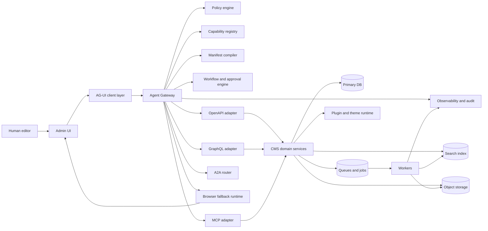
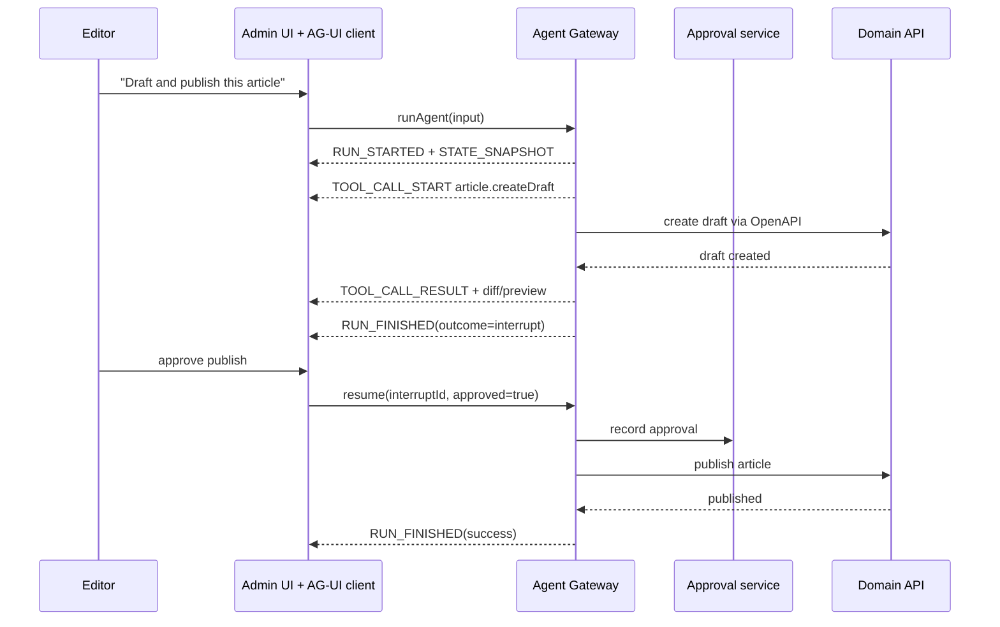

# Designing an Agent-Native CMS

## Executive summary

This dossier follows the uploaded brief: a WordPress replacement where authorized AI agents can do anything a logged-in human can do in the admin backend through structured, discoverable, permissioned interfaces, with no raw production database writes by agents. fileciteturn0file0

The core design decision is this: **treat every meaningful admin action as a first-class, typed capability contract**, not as an ad hoc prompt or a fragile browser script. In practice, that means the CMS should expose most reads and writes through **OpenAPI and/or GraphQL domain services**, present those services to agents through an **agent gateway plus MCP wrappers**, expose human-in-the-loop state and approvals through **AG-UI**, support **A2A** only when agents need to collaborate with external or remote agents, and reserve **WebDriver BiDi / Playwright / CDP** for controlled fallback automation when no structured contract exists. MCP is best for tool/resource exposure; AG-UI is best for agent-to-frontend state and approvals; A2A is best for inter-agent delegation; OpenAPI and JSON Schema should be the canonical contract layer for admin writes; GraphQL should be the canonical contract layer for rich reads and search. citeturn41view0turn42view2turn42view3turn31view2turn30view0turn32view2turn33view0turn34view1turn34view4turn21view0turn21view1turn21view2turn54view0turn14view0turn40view0turn38view0turn39view2

The right product paradigm is therefore **not** “make the browser agent smart enough to use the old CMS.” It is “make the CMS natively legible to agents.” That requires five layers working together: a policy-enforcing **agent gateway**, a versioned **capability registry**, a server-side **manifest compiler** that generates page and admin manifests, a **workflow/approval engine** for interrupts and multi-step side effects, and a **browser fallback runtime** that is explicit, audited, and rare. The gateway should be the only entry point for side effects; agents should never write directly to the production database. MCP’s own guidance emphasizes secure access controls, input validation, rate limiting, logging, and human oversight for sensitive operations, and its authorization model is transport-level OAuth-based for HTTP transports. citeturn42view2turn41view0

The most important things teams usually miss are not just protocols. They are **content invariants, reversibility, auditability, selector stability, and approval ergonomics**. Your CMS will need structured support for draft/publish states, preview URLs, diffs, idempotency keys, dry-run validation, rollback or compensation references, revision histories, stable resource IDs, stable accessible names and test IDs, traceable agent sessions, and scoped permissions for both humans and agents. AG-UI already gives you a good event model for runs, steps, tool calls, state snapshots/deltas, and interrupt/resume flows; Playwright and W3C accessibility guidance strongly suggest using roles, labels, visible text, and explicit test IDs as the selector hierarchy for the browser fallback layer. citeturn30view0turn31view2turn32view2turn32view3turn38view0turn35view0

The short recommendation is to build an MVP around **OpenAPI + JSON Schema + AG-UI + MCP + Playwright fallback**, add **GraphQL** for complex reads and universal admin search, defer **A2A** to the point where external or specialized agents truly need to collaborate, and treat **A2UI / generative UI** and **AP2** as emerging layers that should be isolated behind adapters until their standards settle. `llms.txt` is useful for public discoverability, but it is not enough for authenticated admin reasoning; you will still need CMS-native manifests. citeturn21view0turn14view0turn31view2turn42view2turn38view0turn54view0turn33view0turn18view0turn9view0turn26news0turn29academia2

For an implementation-first prototype, the first milestone should be narrow and ruthless: **articles, media, pages, search, navigation, approvals, and audit**. If an agent can reliably create a draft, upload media, edit structured and rich text fields, ask for approval, preview the result, publish, and leave a replayable trace, you already have the foundation for a legitimate WordPress replacement. WordPress itself exposes a useful REST API and uses it as the foundation of the block editor, but the target system here goes further by making agent contracts, risk tiers, manifest generation, and human-agent parity first-class platform concepts instead of afterthoughts. citeturn44view0

## Protocol map

The table below maps the relevant standards and products to concrete roles in an agent-native CMS.

| Protocol or product | Best role in this CMS | Adoption recommendation | Main integration points | Tradeoffs | Primary sources |
|---|---|---|---|---|---|
| **MCP** | Tool/resource facade for agents; adapter layer over internal domain services | **Adopt for agent-facing exposure**, not as the only backend API | Agent gateway, capability registry, read resources, tool execution, sandbox tools | Great agent ergonomics; weaker fit as the sole public product API; tool annotations are untrusted unless the server is trusted | citeturn41view0turn42view2turn42view3turn42view5 |
| **AG-UI** | Agent-to-frontend event protocol and human-in-the-loop UX | **Adopt now** for admin UI and approvals | Admin shell, chat/copilot pane, activity timeline, state sync, interrupts | Excellent for runs, tools, state, interrupts; not your canonical content API | citeturn31view2turn30view0turn32view2turn32view3 |
| **A2A** | Inter-agent delegation and discovery across services or orgs | **Adopt later or at federation milestone** | External agents, plugin agents, commerce agents, remote specialists | Powerful for peer collaboration; overkill for single-product CRUD MVP | citeturn33view0turn34view1turn34view0turn34view2turn34view4 |
| **A2UI / generative UI** | Rich, model-driven UI fragments and component payloads | **Use behind an internal abstraction only** | Manifest compiler, component renderer, admin copilots | The AG-UI ecosystem includes generative UI work, but the detailed UI layer is still draft-like and not yet the kind of stable cross-vendor foundation that OpenAPI or JSON Schema are | citeturn30view0turn31view2turn9view0 |
| **OpenAPI** | Canonical write surface for admin/domain services | **Adopt as the primary mutation contract** | Content, media, workflow, users, settings, plugin APIs, webhooks | Mature tooling, security schemes, codegen, docs, webhooks; can become verbose | citeturn11view0turn21view0turn21view1turn21view2 |
| **GraphQL** | Canonical rich read/query surface | **Adopt for reads and complex search; keep writes selective** | Universal admin search, dashboards, content graph queries, preview composition | Strongly typed and introspective; mutation surfaces can become too permissive if not carefully curated | citeturn54view0 |
| **JSON Schema** | Universal contract language for inputs, outputs, forms, manifests, approvals | **Adopt everywhere** | Capability contracts, page manifests, interrupt payloads, plugin manifests, validators | Essential glue layer; schema discipline is required | citeturn14view0turn42view1 |
| **WebDriver BiDi** | Standards-based browser control fallback | **Adopt as browser-control substrate** | Browser runtime, navigation, locate nodes, screenshots, intercepts | Cross-browser standard direction; still lower-level than Playwright | citeturn40view0turn40view1turn40view2turn40view3turn40view4 |
| **Playwright** | High-level browser automation, testing, traces | **Adopt as default fallback framework** | Browser fallback service, end-to-end agent tests, trace replay | Excellent DX, locators, tracing; still browser-first, so slower and more brittle than structured APIs | citeturn16view3turn38view0turn38view1 |
| **Chrome DevTools Protocol** | Chromium-specific advanced instrumentation | **Use only for Chromium-only gaps** | Deep inspection, snapshots, special debugging | Powerful but unstable at tip-of-tree and browser-specific | citeturn39view0turn39view1turn39view2 |
| **`llms.txt`** | Public, low-friction site discoverability for LLMs | **Adopt for public docs and public content**, not admin authorization | Public docs, public help center, developer documentation | Helpful proposal, not a substitute for authenticated admin manifests | citeturn18view0 |
| **`agent-manifest.json`** | Project-local machine-readable admin and page manifest | **Adopt as a CMS convention** | Every admin route, content page, plugin registry | No stable cross-vendor standard emerged in this research set, so version it carefully and keep it adapter-friendly | citeturn18view0turn34view1 |
| **Schema.org Action / JSON-LD** | Public, SEO-friendly action hints on public pages | **Use selectively on public pages only** | Search, buy, view, subscribe, previewable public actions | Good for public semantic hints; not enough for authenticated, high-risk admin operations | citeturn19view0 |
| **AsyncAPI** | Event and asynchronous workflow contracts | **Adopt for jobs, events, and plugin/event ecosystem** | Publish flows, asset processing, workflow events, notifications | Best for async/event surfaces; does not replace sync admin APIs | citeturn20view0 |
| **Webhooks** | Push notifications to plugins, agents, and external systems | **Adopt with signatures, retries, and idempotency** | Publish events, workflow steps, indexing, automation | Simple and ubiquitous; delivery ordering and retries must be handled explicitly | citeturn21view0turn21view2turn49view2 |
| **x402** | Optional machine payments for pay-per-use APIs or marketplace actions | **Defer unless commerce is central** | Paid plugins, usage-based APIs, marketplaces | Open and HTTP-native; introduces wallet and settlement complexity | citeturn27view0turn27view1 |
| **AP2** | Optional agent-payment authorization layer | **Research-only for now** | Commerce, agent purchasing, mandates | Interesting for agent commerce, but materially less implementation-ready for a CMS core than MCP/OpenAPI/AG-UI in this pass | citeturn26news0turn29academia2turn29academia3 |

The practical stack choice is therefore: **OpenAPI + JSON Schema as the source of truth for mutations, GraphQL for rich reads, AG-UI for UI eventing and approvals, MCP as the agent-facing wrapper, A2A for late-bound external delegation, and Playwright/BiDi as the audited fallback path**. That combination also keeps the platform model-agnostic, because nothing in that stack depends on a single LLM vendor. citeturn21view0turn54view0turn31view2turn42view2turn33view0turn38view0

## Reference architecture

The recommended system architecture is a **policy-centered agent gateway** with adapters rather than a direct “LLM talks to everything” model. MCP itself is a tool/resource protocol with transport-level authorization for HTTP, AG-UI is a lightweight event-driven frontend protocol, and A2A is a peer-collaboration protocol for agent-to-agent tasks. Those standards line up naturally if the CMS sits behind one gateway that owns policy, approval, idempotency, and observability. citeturn41view0turn31view2turn33view0



This architecture keeps **domain invariants** inside CMS services instead of inside prompts. The domain service layer should own content lifecycle rules, media processing, revisions, workflow transitions, permissions, and publication semantics. GraphQL should read from those services or read models. OpenAPI should mutate through those services. MCP should wrap those services as tools/resources for agent consumption. The browser fallback layer should exist, but only as an exception path when the registry says “no structured route exists for this action.” citeturn21view0turn54view0turn42view2turn42view5turn38view0

The **agent gateway** is the critical product boundary. It should do all of the following before any side effect happens: authenticate the user/agent principal, resolve scoped permissions, validate the capability contract and JSON Schema, run rate limits and anomaly checks, produce a dry-run or diff when supported, request approval for high-risk actions, attach trace and audit IDs, dispatch through the correct adapter, and persist the full result envelope. This design follows directly from MCP’s security guidance around access controls, validation, rate limiting, logging, and user confirmation, plus AG-UI’s interrupt/resume lifecycle and OpenTelemetry’s trace/span model. citeturn42view2turn32view2turn37view0turn37view1turn37view2

### Backend interaction surface

| Surface | Best use | Recommendation | Why |
|---|---|---|---|
| **OpenAPI domain services** | Mutations and stable admin operations | **Primary** | Explicit paths, security schemes, webhooks, codegen, client SDKs, structured errors citeturn21view0turn21view1turn21view2 |
| **GraphQL** | Rich queries, search, dashboards, previews | **Primary for reads** | Introspection and typed schemas make it ideal for discoverable read paths and admin search composition citeturn54view0 |
| **MCP** | Agent wrapper over tools/resources | **Primary agent adapter** | Good for discoverable tools/resources and subscriptions, but should sit on top of your canonical domain services rather than replace them citeturn42view2turn42view5 |
| **A2A** | Remote delegation to specialized external agents | **Secondary** | Useful when a CMS agent needs a separate planner, design agent, translator, or commerce agent outside the trust boundary citeturn34view1turn34view4 |
| **Direct DB access** | Diagnostics, analytics replicas, read-only admin internals | **No raw writes in production** | Direct writes bypass policy, invariants, workflows, and audit. If reads are exposed, prefer read replicas or curated data products. fileciteturn0file0 |
| **Browser automation** | Structured gap filler only | **Last resort** | Necessary for parity during migration and plugin gaps, but should remain visible, explicit, and traceable citeturn38view0turn40view0 |

A useful rule is: **all production writes go through domain services; all agent access goes through the gateway; all missing capability coverage is tracked as technical debt**. That rule makes the system flexible enough to evolve later without hard-coding today’s edge cases into brittle prompt logic. citeturn42view2turn21view1

## Capability contracts and manifests

The CMS should model three first-class concepts: **resources**, **capabilities**, and **action contracts**. A resource is a thing an agent can reason about, such as `article`, `mediaAsset`, `navigationMenu`, `user`, `theme`, `workflowRequest`, or `adminSearchResult`. A capability is a permissioned verb bundle over a resource, such as `article.editDraft`, `mediaAsset.replaceFile`, or `workflowRequest.approve`. An action contract is the executable shape of one operation, including schemas, risk tier, idempotency semantics, preview support, rollback/compensation hooks, and preferred transport. This is a design recommendation, but it is directly aligned with MCP tool schemas, GraphQL type systems, OpenAPI security and webhook metadata, and AG-UI interrupt payload schemas. citeturn42view1turn54view0turn21view0turn32view2

### Proposed capability contract schema

```json
{
  "$id": "https://cms.example/schemas/action-contract.json",
  "type": "object",
  "required": [
    "id",
    "title",
    "resource",
    "action",
    "riskTier",
    "authz",
    "inputSchema",
    "outputSchema",
    "execution"
  ],
  "properties": {
    "id": { "type": "string" },
    "title": { "type": "string" },
    "resource": { "type": "string" },
    "action": { "type": "string" },
    "description": { "type": "string" },
    "riskTier": { "enum": ["read", "draft", "publish", "sensitive", "critical"] },
    "authz": {
      "type": "object",
      "properties": {
        "scopesAny": { "type": "array", "items": { "type": "string" } },
        "rolesAny": { "type": "array", "items": { "type": "string" } },
        "conditions": { "type": "array", "items": { "type": "string" } }
      }
    },
    "inputSchema": { "$ref": "https://json-schema.org/draft/2020-12/schema" },
    "outputSchema": { "$ref": "https://json-schema.org/draft/2020-12/schema" },
    "execution": {
      "type": "object",
      "required": ["preferredTransport"],
      "properties": {
        "preferredTransport": {
          "enum": ["openapi", "graphql", "mcp", "a2a", "browser"]
        },
        "endpointRef": { "type": "string" },
        "graphqlOperationName": { "type": "string" },
        "mcpToolName": { "type": "string" },
        "a2aSkillId": { "type": "string" },
        "browserFlowId": { "type": "string" }
      }
    },
    "safety": {
      "type": "object",
      "properties": {
        "supportsDryRun": { "type": "boolean" },
        "supportsPreview": { "type": "boolean" },
        "supportsRollback": { "type": "boolean" },
        "compensationActionId": { "type": "string" },
        "requiresApproval": { "type": "boolean" },
        "approvalPolicyRef": { "type": "string" },
        "idempotencyKeyRequired": { "type": "boolean" }
      }
    },
    "observability": {
      "type": "object",
      "properties": {
        "auditEventType": { "type": "string" },
        "otelSpanName": { "type": "string" },
        "sloClass": { "type": "string" }
      }
    }
  }
}
```

### Risk tiers and control primitives

| Risk tier | Typical actions | Default controls | Notes |
|---|---|---|---|
| **read** | Search, fetch preview, inspect workflow status | Scoped read token, no approval, low rate limits | Prefer GraphQL or MCP resources |
| **draft** | Create draft, edit local text, upload asset to draft | Idempotency, preview, diff, reversible by draft revision | Best early MVP coverage |
| **publish** | Publish page, schedule article, modify navigation | Approval or policy rule, idempotency, audit, rollback/compensation | Should always emit preview/diff first |
| **sensitive** | Change settings, edit users/roles, install plugin | Step-up auth, explicit human approval, anomaly checks, kill-switch coverage | Never permit autonomous execution by default |
| **critical** | Billing, deletion of production data, irreversible migrations | Multi-party approval, time delays, compensating plan or explicit no-rollback warning | Optional in MVP; keep highly constrained |

The essential control primitives are **idempotency keys**, **dry-run/validate-only mode**, **preview/diff generation**, **explicit approval policies**, **rollback or compensation references**, and **full audit envelopes**. OpenAPI makes it natural to document security requirements and inbound webhook/event behavior; AG-UI gives you an interrupt lifecycle for approvals; OpenTelemetry gives you trace/span/event structure for replayable execution paths. citeturn21view0turn21view1turn32view2turn37view0turn37view2

### Page and admin manifests

You should generate two classes of manifest:

1. **Page manifest** for any rendered content page or front-end route.
2. **Admin capability manifest** for any admin route or screen.

The page manifest is mostly for reasoning and optional browser fallback. The admin capability manifest is for actual work: search, navigation, form editing, workflow actions, and structured operations. Neither should be hand-authored if you can avoid it; both should be compiled from route metadata, content schemas, component trees, accessible names, and policy-aware capability resolution. `llms.txt` helps public discovery, but A2A Agent Cards and AG-UI/MCP contracts show why authenticated or privileged capabilities need more structured, product-local metadata. citeturn18view0turn34view1turn42view2turn31view2

#### Example page manifest

```json
{
  "kind": "cms.page-manifest",
  "version": "0.1.0",
  "route": "/about",
  "pageId": "page_01JX...",
  "resourceContext": {
    "type": "page",
    "id": "page_01JX...",
    "locale": "en-US",
    "status": "draft"
  },
  "preferredInterfaces": [
    { "type": "graphql", "ref": "PageEditorQuery" },
    { "type": "openapi", "ref": "patchPageContent" },
    { "type": "mcp", "ref": "cms.page.update" }
  ],
  "visibleActions": [
    "page.editTitle",
    "page.editBody",
    "page.preview",
    "page.publish"
  ],
  "forms": [
    {
      "id": "body",
      "schemaRef": "schema://page/body",
      "richTextModel": "portable-blocks-v1"
    }
  ],
  "navigation": {
    "breadcrumbs": ["Pages", "About"],
    "relatedRoutes": ["/admin/pages/page_01JX/edit"]
  },
  "fallbackSelectors": [
    { "strategy": "role", "role": "textbox", "name": "Page title" },
    { "strategy": "label", "value": "Page title" },
    { "strategy": "testid", "value": "page-title-input" }
  ],
  "generatedAt": "2026-06-03T00:00:00Z",
  "schemaHash": "sha256-..."
}
```

#### Example admin capability manifest

```json
{
  "kind": "cms.admin-manifest",
  "version": "0.1.0",
  "route": "/admin/articles",
  "screenId": "articles.index",
  "search": {
    "querySchema": {
      "type": "object",
      "properties": {
        "q": { "type": "string" },
        "status": { "enum": ["draft", "scheduled", "published"] },
        "authorId": { "type": "string" }
      }
    },
    "resultSchemaRef": "schema://admin/search-result"
  },
  "actions": [
    {
      "capabilityId": "article.createDraft",
      "contractRef": "cap://article.createDraft"
    },
    {
      "capabilityId": "article.publish",
      "contractRef": "cap://article.publish"
    }
  ],
  "widgets": [
    { "id": "table", "type": "resource-list", "resource": "article" },
    { "id": "filters", "type": "search-filters" }
  ],
  "preferredStructuredPolicy": "structured-api-first",
  "browserFallbackAllowed": true
}
```

### Manifest generator rules

The manifest compiler should apply a few hard rules. First, **structured-api-first**: if an action has a valid OpenAPI, GraphQL, MCP, or A2A route, the manifest must prefer that over browser automation. Second, **policy-aware emission**: only emit actions the current principal can actually use. Third, **selector hierarchy**: derive fallback selectors in this order—role plus accessible name, label, visible text, title, explicit test ID, and only then CSS or XPath. Fourth, **version everything**: manifests need semantic versions, schema hashes, and ETags so agents can cache and reason safely. Fifth, **surface missing structure as debt**: if an action is browser-only, the manifest should say so explicitly. That selector order is consistent with Playwright’s own recommendation to prioritize user-facing and role-based locators, and with W3C guidance to prefer visible text, native labeling techniques, and robust accessible names. citeturn38view0turn35view0

### Universal admin search result schema

A universal search result is worth standardizing early because search becomes the main navigation primitive for both humans and agents.

| Field | Type | Example | Why it matters |
|---|---|---|---|
| `type` | string | `article` | Lets agents choose the correct downstream capability |
| `id` | string | `art_01JX...` | Stable resource handle |
| `title` | string | `Quarterly update` | Primary user-facing label |
| `subtitle` | string | `Draft · Marketing · en-US` | Fast disambiguation |
| `breadcrumbs` | string[] | `["Content", "Articles"]` | Navigation grounding |
| `route` | string | `/admin/articles/art_01JX/edit` | Human and browser fallback entry |
| `structuredRefs` | object | `{ "graphql":"ArticleById", "openapi":"getArticle" }` | Structured handoff |
| `availableActions` | string[] | `["article.editDraft","article.publish"]` | Capability-aware planning |
| `permissionState` | string | `allowed` / `approval-required` / `denied` | Avoids wasted agent attempts |
| `lastUpdatedAt` | datetime | `2026-06-03T10:26:00Z` | Freshness and ranking |
| `score` | number | `0.94` | Search ranking signal |

## Admin operations, ecosystem, and governance

The admin UX should feel like **a regular professional CMS with an embedded agent**, not like a chatbot awkwardly glued onto a settings panel. AG-UI already provides the right primitives for this. It defines run lifecycle events, text events, tool-call events, state snapshots and JSON Patch deltas, and interrupt/resume flows where a run can pause for user input and continue later. That makes it a strong fit for an activity timeline, approval inbox, live draft preview, and a step-by-step execution pane attached to every major admin action. citeturn30view0turn31view2turn32view2turn32view3



### Human-agent parity rules

A durable admin product needs explicit parity rules:

| Rule | Operational meaning |
|---|---|
| **Same auth model** | Agents use the same identity, scopes, and policy engine as humans, never a magical superuser path |
| **Structured-first parity** | If a human can perform a common action, the platform should expose a structured capability before accepting browser-only parity |
| **Visible uncertainty** | If the agent falls back to the browser, the UI must show that clearly |
| **Approval by risk** | Risk tiers, not code paths, determine when approvals are required |
| **Replayability** | Every material action can be reconstructed from AG-UI events plus gateway audit records |
| **Explainability** | The user can inspect inputs, diffs, tool args, outputs, and policy decisions |
| **Reversibility by default** | Draft and publish workflows must privilege preview, revision, and rollback/compensation |

### Backend interaction recommendation

For backend interaction, the recommended pattern is:

- **OpenAPI** for durable write operations and administrative commands.
- **GraphQL** for discovery-heavy reads, dashboards, and universal search.
- **MCP** as the agent wrapper for tools and resources.
- **A2A** when the CMS delegates to external or specialized agents.
- **No raw DB writes in production**.
- **Optional, curated DB reads** only through read replicas or shaped data products, never through direct ad hoc write access. fileciteturn0file0

The reason is simple. OpenAPI gives you explicit mutation boundaries and security descriptions. GraphQL gives you introspection and a high-fidelity read model. MCP gives agents a standard way to discover tools and resources. A2A gives agents a way to collaborate as peers rather than being flattened into mere tools. Direct database writes bypass all of the above and destroy the guarantees you need for a CMS: validation, versioning, workflow, permissions, and audit. citeturn21view0turn21view1turn54view0turn42view2turn34view4

### TypeScript gateway pseudocode

```ts
type Principal = {
  subjectId: string;
  actorType: "human" | "agent";
  scopes: string[];
  roles: string[];
};

type ExecuteActionInput = {
  contractId: string;
  args: unknown;
  idempotencyKey?: string;
  dryRun?: boolean;
  traceId: string;
};

async function executeAction(
  principal: Principal,
  input: ExecuteActionInput
) {
  const contract = await capabilityRegistry.get(input.contractId);

  await authz.assertAllowed(principal, contract.authz);
  schemaValidator.validate(contract.inputSchema, input.args);

  const trace = telemetry.startSpan(contract.observability?.otelSpanName ?? contract.id, {
    attributes: {
      contractId: contract.id,
      resource: contract.resource,
      action: contract.action,
      actorType: principal.actorType,
      riskTier: contract.riskTier
    }
  });

  try {
    if (contract.safety?.idempotencyKeyRequired && !input.idempotencyKey) {
      throw new Error("Missing idempotency key");
    }

    const preview = contract.safety?.supportsDryRun && input.dryRun
      ? await adapter.preview(contract, input.args, principal)
      : null;

    if (contract.safety?.requiresApproval) {
      return await approvals.interrupt({
        principal,
        contract,
        args: input.args,
        preview,
        traceId: input.traceId
      });
    }

    const result = await adapter.execute(contract, input.args, principal, {
      idempotencyKey: input.idempotencyKey
    });

    await audit.logSuccess({ principal, contract, args: input.args, result, traceId: input.traceId });
    return result;
  } catch (error) {
    await audit.logFailure({ principal, contract, args: input.args, error, traceId: input.traceId });
    throw error;
  } finally {
    trace.end();
  }
}
```

### Plugin and theme ecosystem

Plugins and themes are where most CMSes lose agent legibility. The fix is to require a **plugin manifest**, score agent readiness, and isolate execution. WordPress’s power partly comes from its plugin ecosystem, but its plugin surfaces are not uniformly structured for agents; your replacement should make structured contracts a marketplace requirement rather than an optional courtesy. WordPress’s own REST API is powerful and extensible, which proves the value of structured access, but that structure is not consistently elevated to the level of a uniform agent contract across the ecosystem. citeturn44view0

#### Example plugin manifest

```json
{
  "kind": "cms.plugin-manifest",
  "version": "0.1.0",
  "pluginId": "com.example.forms",
  "displayName": "Advanced Forms",
  "apiVersion": "2026-06",
  "capabilities": [
    "form.create",
    "form.publish",
    "submission.search"
  ],
  "structuredInterfaces": {
    "openapi": "https://plugins.example/forms/openapi.json",
    "mcp": "https://plugins.example/forms/mcp",
    "events": "https://plugins.example/forms/asyncapi.yaml"
  },
  "sandbox": {
    "networkEgress": ["api.example.com"],
    "filesystem": "none",
    "secrets": ["forms-signing-key"],
    "browserFallbackAllowed": false
  },
  "agentReadiness": {
    "stableIds": true,
    "jsonSchemasComplete": true,
    "supportsDryRun": true,
    "supportsAuditRefs": true
  }
}
```

A practical **agent-readiness score** can be marketplace-facing:

| Dimension | Weight |
|---|---:|
| Structured API coverage | 25 |
| Complete JSON Schemas | 20 |
| Stable accessible labels and test IDs | 15 |
| Dry-run / diff / rollback support | 15 |
| Audit and telemetry hooks | 10 |
| End-to-end contract tests | 10 |
| Sandboxing and declared egress | 5 |

Marketplace rules should require signed bundles, declared scopes, declared egress, schema validation, versioned manifests, and at least one contract-test suite before publish. Unsafe plugins should still be installable in development, but not promoted as “agent-ready.” This is one of the highest-leverage differentiators you can create.

### Safety, governance, and audit

The security base should be **OAuth 2.0 / OIDC for identity and delegated access**, plus **RBAC with optional ABAC predicates** for object-level conditions. MCP’s authorization spec for HTTP-based transport is explicitly OAuth-based, A2A discusses standard web authentication practices including OAuth/OpenID Connect, and OpenAPI supports security schemes and scopes. The lesson is: do not invent agent authentication. Reuse the existing web identity stack and add **scoped agent permissions** on top. citeturn41view0turn33view0turn21view1turn23view0turn23view1

You also need to assume **prompt injection and tool poisoning** are normal threats. MCP explicitly warns that tool annotations should be treated as untrusted unless they come from trusted servers. A2A recommends protecting sensitive Agent Cards and supports authenticated access patterns. For a CMS, that translates into concrete controls: sign manifests where practical, separate descriptive text from executable contracts, treat plugin metadata as untrusted until verified, apply egress allowlists, sanitize rich content before it becomes agent context, and maintain a kill switch that can revoke an agent’s active sessions, tokens, and workflows. citeturn42view1turn42view2turn34view0turn34view1

A minimal audit record should include actor identity, delegated principal chain, capability ID, structured arguments, dry-run or preview artifacts, approval decisions, final execution adapter, affected resource IDs, result or error, trace ID, and replay pointers. OpenTelemetry is well suited here because a trace describes the path of a request, spans represent units of work, span attributes carry structured metadata, and span events can capture meaningful timestamps such as approval granted, fallback entered, or publish completed. citeturn37view0turn37view1turn37view2turn37view3

### Observability, testing, and developer DX

Observability should be **first-class product functionality**, not just infrastructure garnish. Every run should emit: AG-UI event stream, gateway audit events, OTel spans, and an optional browser trace when fallback is used. Playwright already provides trace-viewer support, and AG-UI already provides a normalized event grammar for runs, steps, tools, and state deltas. Together they give you the foundation for replayable sessions and deterministic bug reports. citeturn38view1turn30view0turn32view3turn37view0

The developer experience should include a **TypeScript SDK**, generated OpenAPI clients, GraphQL codegen, an MCP server helper, a CLI manifest validator, a local sandbox with a fake agent, and contract tests that compare the declared capability contract to the actual service behavior. OpenAPI, AsyncAPI, GraphQL, and JSON Schema all have strong tool ecosystems for code generation and validation; that is one reason to make them your backbone rather than inventing a fully proprietary stack. citeturn21view0turn20view0turn54view0turn14view0

## Competitive analysis and MVP roadmap

### Competitive analysis

This table focuses on one question: **how close is each system to the target state of “authorized agents can do anything a logged-in human can do through structured, discoverable, permissioned interfaces”?**

| Product | Verified programmable/admin surface in this pass | Relative fit for agent-native CMS | Main gap versus target | Sources |
|---|---|---|---|---|
| **WordPress** | REST API powers the block editor and exposes posts, pages, media, plugins, settings, users, search, templates, and more | **Medium** | Huge ecosystem, but plugin/admin agent legibility is inconsistent and not normalized around explicit capability contracts | citeturn44view0 |
| **Webflow** | Data API spans sites, pages/components, CMS, assets, comments, ecommerce, webhooks | **Medium** | Strong SaaS APIs, but less suited as a deeply extensible, self-hostable, policy-layer-first admin operating system | citeturn44view1 |
| **Sanity** | Content Lake APIs, schemas, visual editing, agent actions, SDKs, CLI | **High** | Excellent structured content platform; still not the same as a full “human-equivalent admin through one gateway” product | citeturn46view0 |
| **Contentful** | Read/write CMA, environments, optimistic locking, OAuth tokens | **Medium to high** | Strong governance and APIs, but less oriented toward universal admin parity and embedded agent execution flows | citeturn53view0turn53view3 |
| **Shopify CMS** | GraphQL Admin API with access scopes, direct admin extensions | **High for commerce**, **medium for general CMS** | Excellent structured admin surface, but commerce-first domain model and platform constraints | citeturn47view0 |
| **Strapi** | Auto-generated REST API, GraphQL API, OpenAPI spec, admin customization, plugin APIs, docs MCP server | **High potential** | Strong self-hosted base; not yet agent-native as a platform concept | citeturn48view0turn48view1 |
| **Directus** | Dynamic REST and GraphQL over DB schema, SDK, OpenAPI-generated docs | **High potential** | Great autogenerated structure, but DB-mirroring model needs extra governance to avoid overexposed semantics | citeturn48view2turn48view3 |
| **Drupal** | Core JSON:API module | **Medium to high** | Mature structured content, but agent-centered admin UX and manifest generation are not native differentiators | citeturn49view3 |
| **Ghost** | Admin API | **Medium** | Strong editorial scope, narrower platform and ecosystem surface | citeturn49view4 |
| **Builder.io** | **Follow-up needed** | Unknown in this pass | Official developer surface for this specific comparison was not verified in this pass | |
| **Wix** | **Follow-up needed** | Unknown in this pass | Official developer surface for this specific comparison was not verified in this pass | |
| **Squarespace** | **Follow-up needed** | Unknown in this pass | Official developer surface for this specific comparison was not verified in this pass | |

The strongest open-source architectural precedents for your target are **Strapi, Directus, and Sanity’s structured-content posture**; the strongest commercial precedent for deep structured admin APIs is **Shopify**; the strongest cautionary example is **WordPress**, because it shows how a great ecosystem can still leave agents in a fragmented, plugin-by-plugin world if the platform does not impose normalized agent contracts from the start. citeturn48view0turn48view3turn46view0turn47view0turn44view0

### Evaluation tasks and success metrics

| Benchmark task | Success metric | Good MVP threshold |
|---|---|---|
| Create article draft from brief | Task success rate | ≥ 90% |
| Revise title/body/SEO fields | Structured API ratio | ≥ 80% of actions avoid browser fallback |
| Upload media and attach to article | Validation error rate | ≤ 5% failed runs after retry |
| Search admin and navigate to target entity | Retrieval accuracy | ≥ 95% top-3 hit rate |
| Approve publish with edits | Approval round-trip time | < 30 seconds median human-in-loop |
| Publish and verify preview/live state | End-to-end latency | < 60 seconds median |
| Recover from interrupted run | Resume correctness | ≥ 95% |
| Roll back mistaken publish | Rollback/compensation success | ≥ 90% where supported |
| Execute plugin action | Contract conformance | 100% schema validation pass |
| Full replay of session | Replay determinism | ≥ 95% semantic equivalence |

Model comparison should evaluate **task success, structured-api ratio, browser-fallback rate, policy violations blocked, approval accuracy, latency, and cost**. A model that “can reason more broadly” but falls back to the browser constantly is less valuable than a model with slightly weaker planning but much higher structured-action fidelity.

### Prioritized MVP roadmap

| Phase | Goal | What to build first |
|---|---|---|
| **Foundation** | Establish the control plane | Agent gateway, capability registry, OAuth/OIDC, audit envelope, AG-UI admin shell |
| **Structured editorial core** | Prove article/page/media workflows | OpenAPI contracts for draft/edit/preview/publish, GraphQL read layer, manifest compiler |
| **Approval and workflow** | Make side effects safe | Interrupt/resume flows, risk tiers, diff/preview UI, workflow engine, idempotency and replay |
| **Search and navigation** | Make agents effective in admin | Universal admin search index, search result schema, route manifests, breadcrumbs, related actions |
| **Plugin and theme contracts** | Avoid ecosystem drift | Plugin/theme manifests, sandbox rules, agent-readiness score, marketplace policy |
| **Browser parity layer** | Cover hard gaps without normalizing them | Playwright/BiDi fallback service, selector compiler, fallback observability |
| **Federation and optional commerce** | Extend beyond monolith | A2A router, external agent registry, x402/AP2 research if commerce becomes core |

A concrete implementation sequence for a coding LLM should be:

1. Define the **resource model** and action-contract schema.
2. Build the **agent gateway** with auth, validation, idempotency, approvals, and audit.
3. Expose **article/page/media** mutations through OpenAPI.
4. Expose **search and read models** through GraphQL.
5. Wrap the above in an **MCP server**.
6. Add **AG-UI** to the admin shell for runs, state, tool calls, and approvals.
7. Build the **manifest compiler** and emit admin/page manifests.
8. Add **preview, diff, revision, rollback/compensation** semantics.
9. Add **Playwright fallback** plus selector scoring.
10. Add **plugin manifests** and sandbox enforcement.
11. Add **benchmark harnesses** and replayable traces.
12. Add **A2A** only when external agent collaboration becomes a real requirement.

## Open questions and follow-up research backlog

A few areas were intentionally compressed in this token-limited pass and should be treated as **follow-up needed** rather than “done”: formal AP2/UCP commerce standard status, a deeper rich-text concurrency analysis for collaborative agent editing, official developer-surface verification for Builder.io/Wix/Squarespace, and a more exhaustive treatment of multi-tenancy and enterprise deployment options if those become in-scope. citeturn26news0turn29academia2turn33view4

### Open questions

The biggest unresolved product questions are these:

- Do you want **self-hosted**, **managed SaaS**, or **hybrid** as the default deployment model.
- Is **multi-tenancy** a first-class requirement or something to add later.
- Is **commerce** truly optional, or is agent purchasing a planned platform feature.
- What rich-text model should be canonical: HTML-derived blocks, ProseMirror-like JSON, Portable Text–style blocks, or a CRDT-first document model.
- Do plugins run **in-process**, **as isolated workers**, or **as networked extensions**.
- Is the goal strict **human-agent parity**, or do you also want **agent-only fast paths** that humans never see.

### Follow-up research backlog

| Area | Why it matters | Search terms | Specs or repos to inspect | Prototype task for coding LLM |
|---|---|---|---|---|
| **MCP production hardening** | Security, auth, sessioning, subscriptions | `MCP authorization OAuth 2.1 streamable HTTP`, `MCP server tools resources subscriptions` | MCP spec and GitHub links exposed from the official docs citeturn41view0turn42view2turn42view5 | Build a minimal CMS MCP server over article/media tools and resources |
| **AG-UI admin shell** | Human-agent UX, approvals, replay | `AG-UI interrupts state delta JSON Patch events`, `ag-ui-protocol/ag-ui github` | AG-UI docs and GitHub repo link from docs citeturn30view0turn31view2turn32view2turn32view3 | Implement live activity timeline, interrupt approval modal, and run replay pane |
| **A2A federation** | Remote specialized agents | `A2A agent card well-known agent-card.json`, `a2aproject/A2A github` | A2A spec and repo links in official site citeturn33view0turn34view1turn34view0 | Implement remote translation agent discovery and delegated article localization |
| **OpenAPI/GraphQL boundary** | Keep reads/writes clean | `OpenAPI webhooks security schemes GraphQL introspection admin reads` | OAS latest, GraphQL spec citeturn21view0turn21view1turn54view0 | Generate TS clients and policy wrappers from CMS OpenAPI plus GraphQL schema |
| **Browser fallback runtime** | Covers plugin and legacy gaps | `Playwright locators role label testid trace viewer`, `WebDriver BiDi locateNodes navigate` | Playwright docs, WebDriver BiDi, CDP citeturn38view0turn38view1turn40view0turn40view2 | Build selector compiler and fallback runner with trace capture and audit IDs |
| **Manifest compiler** | Agent discoverability per route | `llms.txt page manifests agent card schema.org action`, `accessible names aria labels role locators` | llms.txt, Schema.org Actions, W3C naming guidance, A2A Agent Card docs citeturn18view0turn19view0turn35view0turn34view1 | Generate manifests from route metadata and component accessibility tree |
| **Event and workflow contracts** | Async jobs and plugin ecosystem | `AsyncAPI event-driven APIs webhook retries signatures idempotency` | AsyncAPI, OpenAPI webhooks, webhook implementation refs citeturn20view0turn21view2turn49view2 | Define `article.published`, `asset.processed`, `approval.requested` AsyncAPI files |
| **Observability and replay** | Debuggability and governance | `OpenTelemetry traces spans events replay agent runs` | OpenTelemetry traces docs citeturn37view0turn37view1turn37view2turn37view3 | Instrument gateway, approvals, browser fallback, and plugin calls with OTel |
| **Plugin marketplace policy** | Ecosystem durability | `Strapi plugin API admin panel API`, `Directus OpenAPI dynamic API`, `WordPress REST plugin routes` | Official docs for Strapi, Directus, WordPress citeturn48view0turn48view3turn44view0 | Implement plugin manifest validator and agent-readiness score CLI |
| **Commerce extensions** | Only if monetization matters | `x402 HTTP 402 payments`, `AP2 mandates agent payments protocol` | x402 official docs; AP2 still follow-up-heavy in this pass citeturn27view0turn27view1turn26news0turn29academia2 | Prototype paid plugin execution or paid content transformation action |

### Compact handoff note for a coding LLM

Use this dossier as a **design baseline, not a frozen spec**. The highest-confidence choices are: **OpenAPI for writes, GraphQL for rich reads, JSON Schema everywhere, AG-UI for admin interaction, MCP as the agent wrapper, Playwright/BiDi as audited fallback, and no raw production DB writes by agents**. The highest-priority follow-up items are the **manifest compiler**, **plugin contract model**, **rich-text editing model**, and **official verification of Builder.io/Wix/Squarespace developer surfaces** before making a final market-positioning decision. fileciteturn0file0