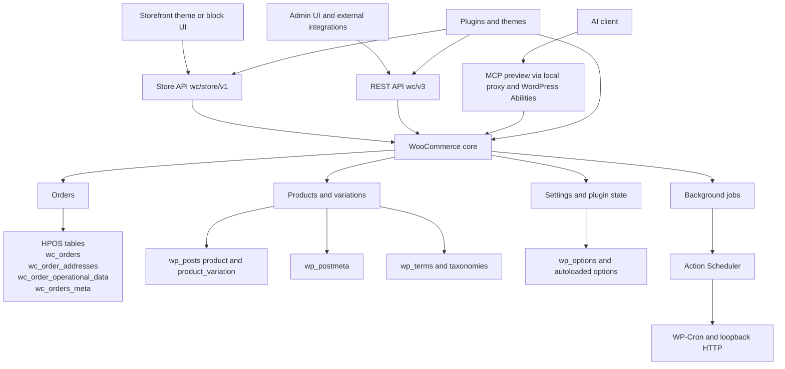
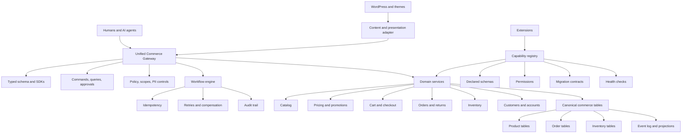

# WooCommerce Architecture Critique, Complaint Analysis, and Agent-Friendly Redesign

## Executive summary

WooCommerce’s biggest problems are not random bugs. They are mostly the predictable consequences of three structural choices: building commerce on top of WordPress internals, preserving backward compatibility for a very large plugin/theme ecosystem, and evolving the platform layer-by-layer rather than around a single, typed commerce core. The result is a product that can be excellent for many small and content-heavy stores, but that accumulates friction in predictable places: update anxiety, plugin conflicts, performance regressions, scaling pain, operational complexity, and awkwardness for modern API-first and AI-agent workflows. Those issues are not niche complaints; as of June 3, 2026, the WooCommerce monorepo showed roughly 2.6k open GitHub issues and 461 open pull requests, Stack Overflow showed 32,958 `woocommerce` questions, and the WordPress.org support forum’s first page alone showed a steady stream of active threads about payments, updates, categories, emails, checkout, and release problems. citeturn54view0turn53view0turn20view2

The deepest architectural problem is historical data modeling. WooCommerce itself now says orders were “traditionally” stored as WordPress posts and post meta, and that this “comes with performance issues.” The HPOS project improves order storage significantly by moving orders to dedicated tables, reducing a new order from one `posts` insert plus almost 40 `postmeta` inserts to at most 5 inserts, and reducing expensive joins. But HPOS fixes only one large part of the platform. In 2026, WooCommerce products are still stored by `WC_Product_Data_Store_CPT`, the core product post type is still registered as `product`, and product organization still depends heavily on WordPress taxonomies and post/meta behaviors. In other words: order storage has been modernized, but the catalog and much of the surrounding system still inherit WordPress-era constraints. citeturn24view2turn24view0turn55view0turn56view0turn55view3

From an AI-agent perspective, WooCommerce is improving, but it is not yet agent-native. Woo now has AI-specific docs, `llms.txt`-style documentation support, and a native MCP integration in developer preview. That is meaningful progress. But the current MCP layer is still narrow, preview status, and proxied through WordPress Abilities and HTTP. Officially documented purpose-built MCP abilities cover product CRUD and a limited order toolset rather than full commerce administration. Meanwhile, the Store API requires nonce-bearing cart and checkout flows, rotates the nonce after successful requests, and explicitly says settings writes belong elsewhere, in the authenticated REST API. That means agents still face a fragmented surface: Store API for shopper-state, REST API for admin/configuration, and preview MCP for some agent workflows. citeturn32view1turn34view0turn33view0turn22view1turn23view0turn22view3

My bottom line is straightforward. WooCommerce is still a strong fit when a merchant values WordPress integration, content-plus-commerce, ownership of data, and high customization at small to moderate scale. It is also incrementally improvable: HPOS, tighter extension contracts, better defaults, better job orchestration, and broader MCP support can reduce a lot of pain. But some of the hardest problems—catalog storage, ecosystem contract fragility, and the lack of a single canonical typed commerce runtime—are only partially solvable inside the current platform shape. If the goal is “agent-friendly commerce” first, rather than “WordPress commerce with agent features added on,” the better long-term answer is a new commerce core or sidecar platform, with WordPress kept as content and presentation infrastructure rather than as the canonical commerce engine. citeturn24view3turn60view0turn45view0turn45view1turn44view3

## What merchants and developers complain about

The complaint pattern is remarkably consistent across official Woo docs, support forums, GitHub, and developer Q&A: breakage around updates, extension conflicts, brittle storefront behavior caused by legacy mechanisms, large-store migration complexity, and a high cognitive load for anyone extending the system safely. Official Woo documentation itself implicitly confirms many of these pain points by recommending backups, staging sites, conflict tests, latest-plugin audits, HPOS compatibility audits, and checks for external systems that still read the posts tables directly. citeturn19view0turn24view3turn60view0

| Complaint | Who feels it most | Concrete evidence | Prevalence | Primary root cause | Mostly caused by | Current fixes or roadmap | Incremental or new-platform |
|---|---|---|---|---|---|---|---|
| Update anxiety and fear of breakage | Merchants, agencies | WordPress.org users asked whether it was “safe” to update; one user asked where version 10.8.0 had gone, and another reported rolling back “like three times.” Official Woo FAQ says breakage after updates may be due to theme/plugin compatibility and recommends staging + conflict testing. citeturn50view0turn50view1turn19view0 | High | Massive compatibility matrix across Woo core, WordPress, themes, extensions, hosting, and custom code | Mostly plugins/themes/ecosystem; partly Woo release surface | Backups, staging, Health Check conflict tests, slower rollout discipline. No universal fix. citeturn19view0turn50view0 | Mostly incremental, never fully eliminated |
| Plugin/theme conflict burden | Merchants, plugin authors | Woo’s own WordPress.org FAQ says issues after updating often come from outdated themes/plugins. HPOS docs say extension developers must change code because the underlying order data structure changed fundamentally. citeturn19view0turn24view3 | High | Weak enforcement of extension contracts plus permissive historical internals | Plugins, themes, Woo backward-compatibility model | Upgrade guides, CRUD APIs, HPOS recipe book. citeturn24view3turn24view1 | Incremental only unless extension model is hardened |
| Legacy mini-cart/cart-fragments performance pain | Merchants, theme developers | Woo officially changed cart-fragments behavior in 7.8 because it was previously enqueued on every page and could cause “severely” increased load on heavily trafficked stores. citeturn58view0 | High on classic-theme stores | Legacy AJAX mini-cart design tied to backward compatibility | Woo core + themes that hard-code widgets + third-party dependencies | 7.8 change, Mini-Cart Block recommendation, future investigation while preserving compatibility. citeturn58view0 | Incremental |
| Order storage and migration pain at larger scale | Merchants, ops teams, extension authors | Woo created HPOS because posts/postmeta-based orders had performance issues; for a test store with 9 million orders, a migration example took about a week. Large-store docs require plugin audits and checks for external systems reading posts tables directly. citeturn24view2turn24view0turn60view0 | Medium to high for larger stores | Historical use of WordPress post/meta model for orders | Woo + WordPress architecture | HPOS stable since WooCommerce 8.2 and default for new installs; migration tooling exists. citeturn24view2turn60view0 | Largely incremental for orders |
| Product/catalog scaling and query pain | Merchants, developers | Core product storage is still `WC_Product_Data_Store_CPT`; the `product` post type is still central; product categories/tags/attributes are WordPress taxonomies; core comments even note hierarchical product post type would cause memory issues because “WP loads all records.” citeturn55view0turn56view0turn55view3 | High beyond modest catalogs | Catalog data still tied to CPT/meta/taxonomy patterns | Woo + WordPress architecture | No HPOS-equivalent catalog replatform in core evidence reviewed | Probably requires deeper platform change |
| Background jobs feel non-deterministic | Merchants, ops, extension authors | Action Scheduler is robust, but officially runs via WP-Cron every minute, plus admin shutdown loopback requests, in batches of 25 until 30 seconds or 90% memory usage. citeturn22view0 | Medium | Request-driven job model layered on WordPress runtime | WordPress + hosting + Woo/action scheduler consumers | CLI, cron hardening, queue tuning, offloading patterns | Incremental, but architecture-limited |
| API and state-management awkwardness | Headless teams, integrators, AI-agent builders | Store API says settings writes belong in the authenticated REST API; Store API cart/checkout endpoints require Nonce or Cart Token; nonce rotates after successful requests; MCP is preview and currently covers only a limited set of product/order abilities. citeturn22view1turn22view3turn23view0turn34view0turn33view0 | High for headless/agentic use, lower for classic stores | Layered API evolution rather than one canonical commerce contract | Woo core | MCP preview, purpose-built abilities, docs for AI. citeturn32view1turn33view0 | Requires major redesign to truly solve |
| Security and patching burden | Merchants, agencies, hosts | Woo disclosed a critical 2021 vulnerability affecting WooCommerce and WooCommerce Blocks, patched 90+ releases, and recommended rotating admin passwords plus payment/API keys after patching. citeturn27view0 | Medium structural risk, episodic incidents | Large plugin/theme surface, flexible request handling, update lag | Core + ecosystem + store operators | Fast response, auto-updates in that incident, ongoing patch discipline. citeturn27view0 | Incremental only |

### Top user and developer quotes

> “I had trouble updating it yesterday and had to rool back my site like three times.” citeturn50view1

> “mini-cart widget [is] still more extendable and easier to customise … than mini cart block” citeturn58view0

> “i probably won’t update our customers stores untill i really have a proper solution” citeturn58view0

> “We’re still investigating safe ways we can reduce this performance hit” citeturn58view0

Those four lines capture the core WooCommerce dilemma better than any abstract argument: extensibility and backward compatibility are valuable, but they repeatedly trade off against performance, clarity, and predictable operations. citeturn58view0turn50view1

## Why the architecture generates these complaints

WooCommerce’s own HPOS history explains the architectural story. Back in 2022, Woo said it had introduced CRUD classes in WooCommerce 3.0 specifically to enable migration away from direct WordPress data stores later, yet orders still remained in `wp_posts` and `wp_postmeta` for years. Woo’s stated reasons for custom order tables were scalability, simplicity, and reliability—precisely the areas where merchants and developers kept feeling pain. That is important because it means the platform itself has already acknowledged that WordPress’s generic content model was not an ideal long-term fit for core commerce records. citeturn24view1turn24view2

HPOS is real progress. Woo says the old order model required one insert into `posts` plus almost 40 inserts into `postmeta` for each order, while the new structure can require at most five inserts. Woo also says previously many order searches required multiple joins against `postmeta`, whereas HPOS reduces both joins and table sizes. For order-heavy stores, that is not cosmetic; it is a fundamental architectural repair. citeturn24view0turn24view2

But the hybrid architecture is where the broader critique begins. In 2026, the product data store is still explicitly named `WC_Product_Data_Store_CPT`, described in code as “Stored in CPT,” and still uses numerous internal meta keys like `_sku`. Product categories, tags, attributes, visibility, and shipping classes are still registered as WordPress taxonomies, attached to `product` and `product_variation`. The product post type itself is still registered by WooCommerce in core, and the code even includes a revealing comment: making it hierarchical would cause memory issues because WordPress “loads all records.” That comment is unusually candid evidence that Woo’s catalog layer still lives inside the constraints of WordPress’s content architecture. citeturn55view0turn55view3turn56view0

The configuration model inherits a second class of WordPress problems. In WordPress core, `update_option()` explicitly warns that autoloading too many options can create performance problems, `wp_load_alloptions()` loads and caches all autoloaded options, and newer WordPress changes exist specifically to disable autoloading for large options by default above 150 KB and to flag sites whose total autoloaded options exceed 800 KB. That is not a WooCommerce bug by itself; it is a WordPress foundation issue. But commerce sites with many plugins, gateways, settings panels, and extension data disproportionately run into exactly this kind of options bloat. citeturn21view0turn57view0turn57view1turn57view2

The extension contract problem is the third architectural fault line. Woo’s HPOS recipe book explicitly says that directly reading from WordPress order tables may return outdated data and directly writing there may update records that are no longer authoritative. Large-store migration guidance goes further and tells merchants to audit non-PHP systems such as warehouses, shipping trackers, and accounting systems to make sure they are not reading the posts tables directly. That is the hallmark of a platform whose extension ecosystem historically depended too much on internal storage details, not just stable domain APIs. citeturn24view3turn60view0

The diagram above is not speculative; it is a direct synthesis of Woo’s official API docs, HPOS docs, MCP docs, Action Scheduler docs, and core code showing the product/catalog layer still built around post types and taxonomies. citeturn22view1turn22view2turn33view0turn22view0turn24view2turn55view0turn56view0turn55view3

## Performance, scaling, security, and maintenance

Performance in WooCommerce is best understood as a threshold problem, not a binary “scales / does not scale” claim. Woo itself still advertises that it can scale, and that is true for many stores. But the amount of architectural discipline required increases sharply with catalog size, extension count, and order volume. Official HPOS guidance for large stores recommends fully mirrored local and staging tests, CLI migrations, repeated flow validation, and audits of third-party systems reading posts tables; Woo’s own example says a 9-million-order test-store migration took about a week. That is not evidence that Woo cannot scale; it is evidence that scaling is operationally expensive and no longer “just install plugin and go.” citeturn19view0turn60view0turn24view2

### Performance and scale thresholds

The following chart is an **analytical synthesis**, not a vendor-published benchmark. It summarizes the relative operational pressure a typical WordPress + PHP + MySQL WooCommerce stack faces at the user-requested scale points, using the official evidence reviewed above: old order-write amplification, HPOS migration cost, Action Scheduler’s WP-Cron/loopback execution model, the continued product CPT/meta model, and WordPress autoload behavior. citeturn24view0turn60view0turn22view0turn55view0turn56view0turn57view0turn57view2

| Scale scenario | Order-path pressure | Catalog-path pressure | What usually changes at this threshold |
|---|---:|---:|---|
| 10k products / orders | `███░░░░░░░` 3/10 | `████░░░░░░` 4/10 | Woo is usually viable if extension count is controlled, HPOS is enabled for orders, and caching is sane |
| 100k products / orders | `██████░░░░` 6/10 | `███████░░░` 7/10 | Query shape, indexing, plugin quality, object cache, async jobs, and admin/search UX become material concerns |
| 1M products / orders | `████████░░` 8/10 | `█████████░` 9/10 | Order migration and ops become programs; catalog storage design becomes a structural bottleneck, not just a tuning issue |

Woo’s legacy cart and mini-cart behavior is another good example of performance-by-architecture. Woo’s cart-fragments post explains that before WooCommerce 7.8, the cart fragments script was enqueued on every page load even if the mini-cart widget was not present, causing unnecessary AJAX requests and, on heavily trafficked stores, potentially “severely” affecting server load and responsiveness. Woo improved the default in 7.8 and recommends the Mini-Cart Block because it does not use cart fragments. But the same article and its comments also show why these fixes are not trivial: the old widget is still more extensible for many developers, some themes hard-code the widget, and some developers reported practical rollout issues after the change. That is a classic backward-compatibility trap. citeturn58view0

Background work is similarly “good enough until it isn’t.” Action Scheduler is battle-tested and Woo highlights its ability to process large queues, even 50,000+ jobs and more than 10,000 actions per hour under certain conditions. But the same official docs show that it relies on WordPress WP-Cron, shutdown hooks in wp-admin, and loopback HTTP requests; it claims and processes actions in batches of 25 until it hits either 90% memory or 30 seconds runtime. That is a clever WordPress-native queue, but it is not the same thing as a fully externalized durable workflow engine with first-class retries, dead-lettering, and isolation. It works; it is also inherently less deterministic than modern workflow systems. citeturn22view0

Maintenance burden is one of WooCommerce’s most under-discussed “performance” problems because it shows up as human latency rather than server latency. The official WordPress.org plugin page says automatic updates usually work smoothly but still recommends backups, and its FAQ says that if a site breaks after a Woo or extension update, the cause may be compatibility issues with themes or plugins—then recommends running a conflict test or using a staging site. On June 2–3, 2026 support threads, users were still asking whether a patch release was safe and what to do when version 10.8.0 disappeared from the update path. That tells you the real ops model: Woo often performs acceptably, but many merchants and agencies treat updates as controlled releases rather than routine maintenance. citeturn19view0turn50view0turn50view1

Security is similar. WooCommerce is not uniquely insecure, but its attack surface is broader than a tightly controlled SaaS or a smaller extension ecosystem because it lives inside the WordPress plugin/theme universe. Woo’s own 2021 incident post describes a critical vulnerability affecting WooCommerce and WooCommerce Blocks, says the team patched 90+ releases and rolled out automatic updates for affected branches, and recommended rotating admin credentials as well as payment/API keys. That incident supports two opposing truths at once: first, that the platform has meaningful real-world security exposure; second, that the Woo team has shown it can respond forcefully and transparently when required. citeturn27view0

### Prioritized problem list

| Problem | Severity | Affected users | Evidence strength | Root cause | Cause locus | Common workaround | Long-term fix | Addressed now | Incremental or new-platform |
|---|---|---|---|---|---|---|---|---|---|
| Product/catalog CPT + meta + taxonomy model | Critical at larger scale | Merchants, developers, search/catalog teams | Very strong | Catalog still rides WordPress content primitives | Woo + WordPress | Aggressive caching, careful query/index design, external search | Dedicated catalog tables/services | No core evidence of equivalent-to-HPOS fix | Likely needs major replatform |
| Extension compatibility and update fragility | High | Merchants, agencies | Strong | Permissive ecosystem + weakly enforced contracts | Plugins/themes + Woo | Staging, backups, plugin budgets | Stronger capability manifests and compatibility contracts | Partly addressed only by process | Incremental only |
| API fragmentation for headless and agents | High | Integrators, AI-agent builders | Very strong | REST + Store API + preview MCP, mixed auth/state | Woo | Custom wrappers, token/nonce handling middleware | One canonical typed commerce API | Not solved | Major redesign |
| Historical order storage complexity | High but falling | Order-heavy stores | Very strong | Old posts/postmeta order model | Woo + WordPress | Enable HPOS, CLI migration, compatibility audits | Finish domain-native order model and deprecate legacy reads | Partly addressed by HPOS | Incremental for orders |
| Background job determinism | Medium to high | Ops teams, subscription-heavy stores | Strong | WP-Cron + loopback-driven queue semantics | WordPress + hosting + Woo | Real cron, CLI workers, queue hygiene | Durable workflow engine with retries/compensation | Partly addressed by Action Scheduler | Incremental, architecture-limited |
| Cart fragments legacy frontend behavior | Medium | Theme devs, performance-sensitive stores | Strong | Old widget/AJAX pattern preserved for compatibility | Woo + themes | Mini-Cart Block, conditional enqueue | Deprecate legacy widget path gradually | Partly addressed since 7.8 | Incremental |
| Direct DB coupling by plugins and external systems | Medium to high | Extension authors, large stores | Very strong | Historically porous internal boundaries | Plugins/integrations + Woo history | Use CRUD APIs, audit direct SQL | Versioned extension contracts, data ownership rules | Partly addressed in docs | Needs stronger platform governance |
| Security and patching surface | Medium structural risk | Everyone | Strong | Large extension/theme surface and WordPress flexibility | Core + ecosystem + operators | Prompt updates, key rotation, plugin minimization | Smaller trusted surface + stronger isolation | Never “done” | Incremental only |

## APIs, data model, and AI-agent friendliness

WooCommerce’s official API story is functional, but fragmented. The REST API is the general authenticated CRUD/admin surface. The Store API is storefront-oriented and read-heavy, explicitly saying it cannot be used to write store settings and directing users to the authenticated WooCommerce REST API for more extensive access. The official MCP layer is then added on top as a separate integration path, currently in developer preview. Viewed from a human WordPress-plugin mindset, that layering is understandable. Viewed from an API platform or agent platform mindset, it is a sign that Woo lacks one canonical commerce contract. citeturn22view2turn22view1turn33view0

The Store API is especially revealing. It is intentionally session-oriented: the cart API returns the cart for the current session or logged-in user; POST endpoints require a Nonce Token or Cart Token; the nonce must be stored and updated after each successful request; and the nonce docs say there is “no other mechanism” for creating the nonce besides `wp_create_nonce( 'wc_store_api' )`. That is perfectly reasonable for a browser storefront. It is much less elegant for autonomous, multi-step agents, orchestrators, or server-to-server workflows that want stable, explicit authorization and deterministic state transitions. This is not a theoretical criticism; it follows directly from the official Store API and nonce docs. citeturn22view3turn23view0

Woo’s MCP work is a genuine positive signal. The AI docs say Woo includes native MCP support. The MCP docs say Woo exposes purpose-built abilities through the WordPress Abilities API, prefers purpose-built domain abilities over raw REST projection, and wants those abilities to be “focused on agent-friendly store operations.” Those are exactly the right ideas. The problem is maturity and scope: the docs also say MCP is still in developer preview, uses a local proxy and remote WordPress server pattern, and currently exposes only limited product and order operations in its purpose-built abilities. That means Woo is moving toward agent-friendliness, but it is not there yet. citeturn32view1turn33view0turn34view0

The data-model limitations reinforce the API limitations. HPOS’s order-query docs explicitly say new query types were added because complex order queries previously required custom code and SQL. The custom order table plan says Woo still provides an order meta table as a “backup solution” for extensions that haven’t migrated, but encourages developers not to use it for common order values and explicitly recommends dedicated tables for plugins that store large amounts of data. That is good platform evolution, but it also means Woo’s extension story still depends on developers learning when **not** to use the default generic storage abstraction. In a truly agent-friendly platform, that distinction would be encoded more strongly in contracts, schemas, and generated capabilities rather than in recipe books and best-practice prose. citeturn23view1turn23view3

## Comparison with alternatives

The alternatives do not all beat WooCommerce in every dimension. Shopify is more controlled but more constrained. Adobe Commerce is broader but heavier. Saleor, Medusa, and Sylius require more engineering commitment. BigCommerce is more managed. But the comparison is still useful because it shows what WooCommerce is missing when viewed as an API/native-agent platform rather than as a WordPress plugin.

| Platform | Official architecture and API posture | Agent friendliness | Main advantage over Woo | Main tradeoff versus Woo |
|---|---|---|---|---|
| **WooCommerce** | Official APIs are REST `wc/v3`, Store API `wc/store/v1`, and preview MCP; orders have HPOS, but products remain CPT-based and taxonomy-heavy. citeturn22view1turn22view2turn24view2turn55view0turn56view0 | Improving, but still fragmented | Deep WordPress integration, ownership, huge ecosystem | Fragmented API/auth model, plugin fragility, legacy data model |
| **Shopify** | GraphQL Admin API with versions, official client libraries, access scopes, and Shopify Functions for backend logic customization. citeturn35view0turn44view1 | Strong | Single typed admin surface and first-class extension primitives | SaaS constraints; some custom-function capabilities depend on plan/app model |
| **Adobe Commerce / Magento** | Official GraphQL covers broad catalog/cart/checkout/customer/B2B company operations, including rich cart mutations. citeturn44view2 | Moderate to strong | Much broader official domain API coverage than Woo’s split Store/REST pattern | Heavier platform and greater implementation complexity |
| **BigCommerce** | Managed REST + GraphQL storefront APIs, built-in request runner, `llms.txt` support, and beta MCP server for storefront tools. citeturn37view0turn38view0turn38view1 | Strong and moving fast | More managed ops and clearer agent/documentation story | Less low-level ownership than self-hosted Woo |
| **Saleor** | GraphQL-powered platform; docs say the GraphQL schema is the source of truth, provide AI-agent docs, MCP guidance, and OpenTelemetry-based observability. citeturn45view0turn45view1turn45view3turn42view1 | Very strong | Schema-first design, AI-ready docs, observability, extensibility | Higher engineering responsibility; more “platform build” than plugin install |
| **Medusa** | Commerce Modules, Workflows with rollback/consistency semantics, Admin and Store APIs, and explicit AI-assistant/MCP tooling docs. citeturn44view3turn46view0 | Very strong | Modular domain design and workflow-centric customization | More build responsibility and less out-of-the-box merchant simplicity |
| **Sylius** | Headless orientation, powerful REST API, API Platform foundation, and cloud-friendly hosting/scaling story. citeturn44view0 | Good | Cleaner headless/custom-enterprise posture than Woo | Requires engineering effort and Symfony-centric expertise |
| **Headless Woo** | A decoupled frontend can use Store API/REST and even MCP preview, but still inherits WordPress admin state, plugin contracts, and product CPT storage. citeturn22view1turn22view2turn33view0turn56view0 | Better than classic Woo, still not native | Better storefront flexibility without full replatform | Core data-model and extension problems remain |

The comparison suggests a simple rule: WooCommerce is strongest when the winning dimension is **content + flexibility + ownership**; it is weakest when the winning dimension is **schema-first operations + uniform APIs + durable workflows + agent-native tooling**. Platforms like Saleor and Medusa are much closer to the latter end of the spectrum, while Shopify and BigCommerce package more of it into managed SaaS. citeturn19view0turn35view0turn37view0turn45view0turn46view0turn44view0

## Proposed agent-friendly redesign

The redesign I would propose is not “rewrite everything in Rust” or “put an LLM on top of wp-admin.” It is a domain-centric re-foundation: keep WordPress where it is genuinely strong, but move Woo’s canonical commerce execution model into an explicit, typed, observable commerce core.

The strongest case for this shape comes from combining Woo’s current pain points with what other platforms already formalize. Saleor’s docs explicitly treat the GraphQL schema as the source of truth and expose AI-agent guidance around that schema. Medusa’s docs formalize modular commerce domains and workflows with rollback semantics. BigCommerce and Woo themselves now publish AI-oriented docs and MCP entry points. Woo’s own MCP docs say purpose-built abilities should be focused on agent-friendly store operations. The direction of travel across the industry is clear: typed contracts, discoverable tools, least-privilege access, and workflow-native execution. citeturn45view0turn45view1turn44view3turn46view0turn38view0turn33view0

A practical redesign would have five pillars.

**Canonical commerce API.** Woo should converge REST, Store API, and MCP into a single canonical contract that supports both human-built apps and agents. The key idea is not merely “add GraphQL,” but “define one source of truth for commerce operations,” with generated clients, stable schemas, capability discovery, and explicit auth scopes. Shopify’s GraphQL Admin API, Saleor’s schema-centric model, and BigCommerce’s agent-facing/MCP posture all point in this direction. citeturn35view0turn45view0turn38view0

**Domain-native storage beyond orders.** HPOS proves the order layer needed commerce-specific tables. The same logic now applies to products, variants, inventory, pricing, bundles, and search projections. As long as the catalog remains a CPT/meta/taxonomy composition, Woo will continue to hit scaling and modeling limits that are only partially tunable. Medusa’s modular domain packaging and Sylius’s API-first headless posture are better reference shapes here than older WordPress storage conventions. citeturn24view2turn55view0turn56view0turn44view3turn44view0

**Durable workflows instead of request-era orchestration.** Critical commerce flows such as checkout finalization, inventory reservation, refund cascades, renewal billing, ERP sync, fraud review, and agent-issued bulk changes should not depend primarily on WP-Cron cadence, loopback requests, and time-boxed PHP requests. Woo does have Action Scheduler, and it works well in many conditions, but the future should look more like workflow orchestration with retries, compensation, idempotency keys, and explicit visibility. Medusa’s workflow model and Saleor’s explicit telemetry point toward the right operational standard. citeturn22view0turn44view3turn45view3

**Harder extension contracts.** HPOS migration guidance exists because too much external code depended on direct storage details. A better model is a capability registry in which every extension declares schemas, permissions, indexes, migrations, and health surfaces. Woo already has a seed of this idea in MCP/Abilities. It should push that pattern downward into the wider extension ecosystem so a plugin cannot silently become authoritative over critical data without a declared contract. citeturn24view3turn60view0turn33view0

**Agent governance as a first-class concern.** Woo’s MCP docs rightly warn that order and customer operations can expose PII and advise least-privilege scopes and key rotation. An agent-native redesign should make that governance structural: human approval gates for destructive operations, replayable audit logs, policy simulation, scoped tools by role, and mutation sandboxes. In other words, “agent-friendly” should not mean “easier to let a bot do dangerous things”; it should mean “safer, clearer, and more accountable automation.” citeturn33view0

### What can be fixed inside Woo and what probably cannot

The most realistic incremental path inside WooCommerce is:

- broaden MCP from limited product/order tools into a truly useful commerce toolset;
- unify auth semantics where possible so agents do not juggle browser-storefront nonces and separate admin credentials for related tasks;
- continue domain-table migrations beyond orders;
- deprecate legacy cart-fragments paths more aggressively while providing migration tooling for themes;
- strengthen extension contracts and compatibility tooling. citeturn33view0turn34view0turn58view0turn24view3turn24view2

What probably requires a new platform or at least a sidecar commerce engine is:

- product/catalog authority outside the CPT/meta model;
- a single canonical typed commerce API;
- durable workflow orchestration beyond request-era WordPress mechanics;
- explicit extension capabilities and schema governance as the default rather than an optional best practice. citeturn55view0turn56view0turn22view0turn45view0turn44view3

## Counterarguments and what should be built next

A rigorous critique should also say clearly what WooCommerce gets right. The WordPress.org plugin page makes a strong case that still matters in practice: Woo is open source, merchants keep ownership of data, the platform combines content and commerce in one stack, developers can use hooks and filters and inspect core code, and the marketplace plus integration breadth are real strategic assets. Woo also explicitly claims data ownership, extension vetting for marketplace products, REST APIs, and the ability to scale high-volume stores. Those are not empty talking points; they explain why Woo remains important and why many merchants rationally choose it despite the complaints documented above. citeturn19view0

Woo also deserves credit for the modernization it is already doing. HPOS is not superficial; it is a serious architectural repair. The cart-fragments changes show willingness to revisit legacy defaults for performance reasons. The AI docs, repository agent skills, and MCP preview show that Woo has understood the direction of the developer platform. So the issue is not that Woo is stagnant. The issue is that the modernization is still uneven: one repaired subsystem sits beside several still-legacy ones. citeturn24view2turn58view0turn32view1turn33view0

### What should be built next

If I were prioritizing the next thing to build, I would not start with more prompt engineering. I would start with the platform contract.

**Build a unified commerce control plane.** One canonical contract for products, variants, pricing, carts, checkout, orders, customers, inventory, and promotions. Let REST, MCP, and any future GraphQL layer become transport choices over the same domain surface, not separate conceptual products. That is the single highest-leverage improvement for both humans and agents. citeturn22view1turn22view2turn33view0turn45view0

**Build catalog-native tables and projections.** HPOS proved the pattern on orders. Repeat it for the catalog. Without that, Woo will continue to fight WordPress’s CPT/meta/taxonomy ergonomics in the very area where scale hurts most. citeturn24view2turn55view0turn56view0

**Build a durable workflow engine.** Critical commerce actions should not ultimately rely on WP-Cron cadence and loopback semantics. This is especially important if agents will be allowed to orchestrate business operations rather than merely suggest copy or edit metadata. citeturn22view0turn44view3

**Build extension capability manifests.** Every important plugin should declare what data it owns, what tables and APIs it touches, what permissions it needs, what migrations it performs, and what health checks it exposes. HPOS would have been less painful if this discipline had existed earlier. citeturn24view3turn60view0

**Build agent governance into the platform.** Approval flows, least-privilege scopes, replayable audit, PII redaction, and safe mutation boundaries should be part of the product, not left to ad hoc integrator discipline. citeturn33view0

### Open questions and limitations

This report is strongest on architecture, official platform behavior, and high-confidence operational pain points. It is less precise on population-level prevalence because community sources such as support forums, Stack Overflow, Reddit, and similar venues are inherently selection-biased toward people who encountered difficulty. The performance threshold chart is an analytical synthesis from official docs and code, not a controlled benchmark. And store outcomes vary sharply with hosting quality, object caching, search strategy, extension count, and custom engineering discipline. Those limitations do not overturn the main conclusion; they mainly affect *how severe* the pain becomes, not *where* it tends to originate.