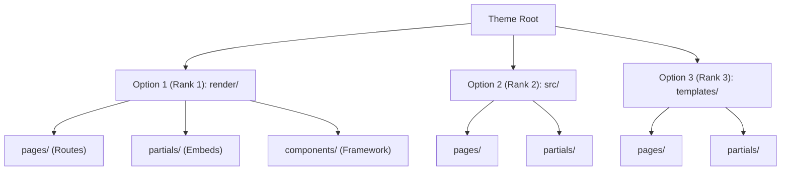

ACK_PACKET_RECEIVED tovu-theme-invariant-structure-round2 -- I received the packet and will work on it.

---

# Round 2 Informed Rebuttal & Final Consensus Proposal: Tovu Unified Theme Invariant Specification (TUTIS-v2)

---

## 1. Direct Positions on the 4 Lettered Disagreements (A–D)

| Disagreement | Round 1 Position | Round 2 Position (Committed) | Core Rationale |
| :--- | :--- | :--- | :--- |
| **A. Render Source Folder** | `templates/` | **`render/`** (subdivided into `pages/`, `partials/`, and optional `components/`) | `templates/` is factually false for static HTML, declarative AST blocks, and component frameworks. `src/` creates structural ambiguity alongside top-level `css/`, `scripts/`, and `assets/`. `render/` has exactly one enforceable contract: *all files interpreted by `renderer.adapter` live here*. |
| **B. Agent Element Handle Attribute** | `data-agent-element` | **`data-tovu-agent`** | Reusing `data-agent-element` across the admin control-plane and public, untrusted visitor-facing theme markup breaches the privilege boundary. `data-tovu-agent` preserves the exact grammar (`handle.name`) while separating administrative control from visitor-facing agent metadata. |
| **C. Manifest Key for Partials/Slots** | `slots` | **`partials`** | "Slot" collides head-on with modern Web Component/Vue/Svelte slot semantics (which project content inward). Furthermore, ground truth confirms `partial` is one of 6 embed types (`partial`, `menu`, `widget`, `form`, `media`, `post`). Naming the manifest key `partials` creates exact 1:1 alignment with the embed engine. |
| **D. Dev-Time Agent Guidance Location** | Root `AGENTS.md` + `tests/` | **Root `AGENTS.md` + `tests/` (Reaffirmed)** | Dev-time coding agent instructions (source conversion, token mapping, hot-reload rules) have a completely different lifecycle, audience, and security scope than runtime visitor-facing WebMCP capabilities (`ai/`). Co-locating them in `ai/` leaks dev tooling into published production builds. |

---

## 2. Evolution from Round 1 & Influencing Peer Arguments

### Changed: `templates/` $\rightarrow$ `render/` (Disagreement A)
* **Moved by:** **Codex** (supported by Coordinator’s Round 2 reversal).
* **Why:** In Round 1, my argument for `templates/` was minimizing churn for existing `templated` and `declarative` themes. Codex’s counter-argument shattered this: calling static HTML or declarative JSON AST "templates" is technically incorrect, and calling React/Svelte/Vue components "templates" breaks standard frontend semantics. More decisively, Codex and Coordinator exposed why Fable's `src/` fails: in modern JS/TS ecosystems (Next.js, Astro, Vite), developers treat `src/` as an all-encompassing junk drawer containing styles, scripts, utils, hooks, and static assets. If `css/`, `scripts/`, and `assets/` are invariant top-level siblings, `src/` causes immediate mental drift. **`render/`** provides an unambiguous, validator-enforceable definition: *everything inside `render/` is consumed strictly by `renderer.adapter`*.

### Changed: `data-agent-element` $\rightarrow$ `data-tovu-agent` (Disagreement B)
* **Moved by:** **Codex** and **Coordinator**.
* **Why:** In Round 1, Flash, Fable, and Pro prioritized ergonomic parity with `apps/admin`. Codex and Coordinator rightly identified a critical **privilege-boundary hazard**: `apps/admin` operates inside an authenticated, single-tenant administrative surface with write/mutate permissions. Themes in the marketplace will be authored by untrusted third parties and rendered for public, multi-tenant visitors. Sharing the exact attribute string creates a dangerous false equivalence where an agent, security scanner, or developer might assume theme elements inherit admin-level capabilities. Keeping the syntax/grammar identical (`domain.action`) while prefixing the attribute as `data-tovu-agent` maintains full developer familiarity while enforcing a strict trust boundary.

### Changed: `slots` $\rightarrow$ `partials` (Disagreement C)
* **Moved by:** **Fable** and **Codex**.
* **Why:** In Round 1, I kept `slots` under `rendering.slots`. Fable’s point that "slot" means inward projection in modern UI frameworks (Vue/Svelte/Astro/Web Components) is incontrovertible. Renaming to `partials` avoids this confusion. Furthermore, the new ground truth reveals that Tovu's embed engine natively uses `{"type":"partial", ...}` as one of its six core embed types. Standardizing the manifest on `partials` aligns the manifest, filesystem (`render/partials/`), and embed marker engine into a single unified concept.

### Reaffirmed: Root `AGENTS.md` + `tests/` strictly separate from `ai/` (Disagreement D)
* **Opposing:** Gemini 3.1 Pro (who proposed `ai/instructions.md`).
* **Why:** Fable, Codex, Flash, and the Coordinator unanimously agree that `AGENTS.md` is the universal, toolchain-agnostic standard for coding agents (Claude Code, Cursor, Copilot CLI, Gemini CLI). Placing coding instructions inside `ai/` conflates two entirely different domains:
  1. `ai/` is **runtime metadata** for visiting AI agents (WebMCP tools, semantic handles, evaluation targets).
  2. `AGENTS.md` is **dev-time source guidance** for LLMs maintaining or converting the theme code. It should be strippable at packaging time without altering the site's runtime AI surface.

---

## 3. Steelman Counter-Arguments (The Strongest Case Against My Current Position)

### Steelman against `render/` (Defending `src/` or `templates/`):
* **The Case for `src/`:** Every developer on GitHub instinctively navigates to `src/` when inspecting a repository. Tools like ESLint, Prettier, TypeScript, and Babel default their globs to `src/**`. Inventing a novel top-level directory named `render/` forces every external tool, CI script, and coding agent to add custom path mappings, whereas `src/pages/` (used by Astro, SvelteKit, and Next.js Pages router) is universally understood without documentation.
* **The Case for `templates/`:** Liquid, Shopify, Jekyll, Jinja, Django, and Hugo all standardize on `templates/`. Since Tovu's existing live themes are predominantly Liquid and Static HTML with marker substitution, keeping `templates/` requires zero file moves for existing themes and aligns with standard CMS theme architectures.

### Steelman against `data-tovu-agent` (Defending `data-agent-element`):
* Reusing `data-agent-element` allows the Tovu frontend platform to share a single unified DOM resolver and test harness across both admin and storefront surfaces. By introducing `data-tovu-agent`, every agent inspection script, selector utility, and synthetic testing harness must maintain two separate query paths (`[data-agent-element]` vs `[data-tovu-agent]`). The trust boundary is already enforced at the runtime capability registry (`capability-registry.ts`), which requires explicit authentication regardless of what DOM attributes are present.

### Steelman against `partials` (Defending `slots`):
* In headless CMS and design systems, "slot" is the standard term for a designated zone where dynamic content is plugged in (e.g., WordPress Template Parts / Slots, Webflow Slots). Calling everything `partials` feels retroactively tethered to 1990s server-side includes (SSI/PHP) rather than modern component composition.

### Steelman against Root `AGENTS.md` (Defending `ai/instructions.md`):
* Having a single `ai/` top-level directory that encapsulates *everything* related to artificial intelligence (both dev-time coding agent guidance and runtime agent capabilities) prevents root-level clutter. A coding agent scanning the project needs to inspect only the `ai/` folder to understand both how to edit the theme and what capabilities the theme exposes.

---

## 4. Falsifiability & What Evidence Would Shift My Stance

1. **What would move me back to `src/`:** If real-world benchmark data showed that third-party bundlers (Vite, Rollup, Turbopack) or standard TypeScript path aliases incurred measurable configuration overhead or broke Zero-Config developer workflows when configured with `render/` instead of `src/`.
2. **What would move me back to `data-agent-element`:** If the platform architecture showed that the site assistant agent and the admin assistant agent share an identical unified context window, where maintaining dual attribute vocabularies caused model hallucination or doubled prompt token overhead during DOM tree parsing.
3. **What would move me back to `slots`:** If the component-framework adapter architecture relied directly on native `<slot />` Web Component specifications for server-rendered HTML composition rather than template partial substitution.

---

## 5. Solution Slate Protocol: Render-Layer Source Folder Name (Disagreement A)

### Ranking Criteria
1. **Multi-Tier Semantic Accuracy:** Does the name accurately describe the content across all 5 existing tiers (`declarative`, `templated`, `handlebars`, `static`, `code`) PLUS the future component-framework tier?
2. **Boundary Rigidity & Invariance:** Does the directory name prevent accidental leakage of styles, global scripts, or random utilities into the render layer?
3. **Ecosystem & Cognitive Friction:** How intuitively do human authors and automated AI coding agents understand the folder's responsibility?
4. **Machine Verifiability:** Can a JSON Schema and a hot-reloading tool (like `theme_write_file`) deterministically validate the directory structure without tier-conditional heuristics?

---

### Candidate Slate



#### Option 1 (Recommended / Rank 1): `render/`
* **Layout:** `render/pages/`, `render/partials/`, and optional `render/components/` (component tier only).
* **Pros:**
  - 100% accurate across all 6 tiers: HTML documents, Liquid templates, Handlebars templates, Declarative JSON ASTs, Signed Code modules, and React/Vue/Svelte components are all *render source*.
  - Sharp semantic boundary: Sibling directories (`css/`, `scripts/`, `assets/`, `ai/`) are explicitly excluded from `render/`. It prevents authors from creating `src/utils/` or `src/styles/`.
  - Maps 1:1 to the manifest's `renderer` block.
* **Cons:** Novel top-level directory name; requires configuring `root` or `alias` in standard component bundlers (e.g., `resolve.alias: { '@': '/render' }`).

#### Option 2 (Rank 2): `src/` (with strict mandatory `src/pages/` and `src/partials/` interior)
* **Layout:** `src/pages/`, `src/partials/`, optional `src/components/`.
* **Pros:** Universal ecosystem convention; zero-config compatibility with modern bundlers and IDEs.
* **Cons:** Highly ambiguous when sibling directories `css/` and `scripts/` exist. Authors and coding agents will continually violate invariants by co-locating styles, helpers, and scripts inside `src/`.

#### Option 3 (Rank 3): `templates/`
* **Layout:** `templates/pages/`, `templates/partials/`, `templates/layouts/`.
* **Pros:** Traditional CMS convention; zero file migration needed for current Liquid themes.
* **Cons:** Factually false for static HTML pages, declarative JSON ASTs, signed-plugin code, and component-framework modules (React/Vue/Svelte components are not templates).

---

### Comparative Evaluation Matrix

| Option | Semantic Accuracy (All 6 Tiers) | Boundary Rigidity | Tooling / Bundler Parity | Conformance Simplicity | Final Rank |
| :--- | :---: | :---: | :---: | :---: | :---: |
| **`render/`** | **5/5 (Flawless)** | **5/5 (Strict)** | 4/5 (Requires alias) | **5/5 (Unambiguous)** | **1 (Recommended)** |
| **`src/`** | 4/5 (Good) | 2/5 (Leaky boundary) | **5/5 (Native)** | 3/5 (Needs strict linting) | **2** |
| **`templates/`** | 1/5 (Breaks 4 tiers) | 4/5 (Good) | 3/5 (CMS-centric) | 2/5 (Tier contradictions) | **3** |

**Recommendation:** Adopt **Option 1 (`render/`)** across all tiers.

---

## 6. Comprehensive Invariant Package Specification (TUTIS-v2)

### 6.1 Complete Invariant Directory Layout

```text
<theme-id>/                            # Must strictly match "id" in theme.json
├── theme.json                         # REQUIRED — Single canonical manifest (Schema v2)
├── tokens.json                        # REQUIRED — Base / default-mode design tokens
├── tokens.<mode>.json                 # OPTIONAL — Per-mode token overrides (e.g. tokens.light.json)
├── AGENTS.md                          # RECOMMENDED — Dev-time coding agent instructions & hot-reload contract
├── LICENSE                            # REQUIRED — Machine-identifiable legal license file
├── NOTICE.md                          # OPTIONAL — Free-text legal notices, attribution, conversion narrative
│
├── assets/                            # REQUIRED — All media and distribution assets
│   ├── previews/                      #   REQUIRED: Marketplace preview assets
│   │   ├── card.webp                  #     REQUIRED: 1200x800 primary marketplace card thumbnail
│   │   └── gallery/                   #     OPTIONAL: Additional screenshots/visuals
│   ├── images/                        #   OPTIONAL: Theme runtime images, illustrations, icons
│   ├── fonts/                         #   OPTIONAL: Self-hosted web fonts (.woff2) for offline parity
│   ├── video/                         #   OPTIONAL: Runtime background videos
│   ├── audio/                         #   OPTIONAL: Runtime audio assets
│   └── files/                         #   OPTIONAL: Downloadable assets (PDFs, docs)
│
├── css/                               # REQUIRED — Styling layer
│   ├── theme.css                      #   REQUIRED: Single invariant global stylesheet entrypoint
│   └── vendor/                        #   OPTIONAL: Third-party CSS (e.g., normalize, prism)
│
├── render/                            # REQUIRED — All view layer source (renderer.adapter owned)
│   ├── pages/                         #   REQUIRED: Page-level routes (e.g. index.html, index.liquid, home.json, Home.tsx)
│   ├── partials/                      #   OPTIONAL: Reusable embed partials (nav, footer, header)
│   └── components/                    #   OPTIONAL: Sub-components (Framework tier only)
│
├── scripts/                           # OPTIONAL — Browser-loadable scripts (FORBIDDEN in declarative tier)
│   ├── main.js                        #   First-party client behavior (theme toggles, drawers)
│   └── vendor/                        #   Vendored third-party libraries (offline-safe, pinned, read-only)
│       └── <lib>/                     #     e.g., motion/motion.js + motion/LICENSE
│
├── ai/                                # OPTIONAL — Published-site agent & WebMCP surface (Data only)
│   ├── capabilities.json              #   Tool definitions and exposure permissions (Default-deny)
│   ├── elements.json                  #   Catalog of data-tovu-agent handles and semantics
│   └── scoring.json                   #   Evaluation metrics and conversion task hooks
│
├── locales/                           # OPTIONAL — Theme-owned UI localization strings
│   ├── en.json                        #   Default locale dictionary
│   └── es.json                        #   Translation dictionaries
│
├── tests/                             # RECOMMENDED — Dev-time validation & automated reconciliation
│   ├── cases.json                     #   Test suite definitions (viewports, tokens, settle events)
│   ├── fixtures/                      #   Mock site contexts and collection data
│   │   └── site-context.json
│   └── golden/                        #   Golden regression baselines
│       ├── dom/                       #     Expected HTML / DOM snapshots
│       └── visual/                    #     Expected visual screenshot references
│
└── package.json                       # FRAMEWORK TIER ONLY — Build dependencies (dist/ is NEVER committed)
```

---

### 6.2 Ground-Truth Integration Matrix

In accordance with the verified repository facts:

1. **Complete 5+1 `ThemeTier` Taxonomy:**
   - `"declarative"`: Zero-JS, zero-raw-HTML block AST (`render/pages/*.json`). `scripts/` is forbidden.
   - `"templated"`: Liquid server-side templates (`render/pages/*.liquid`). Engine: `liquid`.
   - `"handlebars"`: Fully supported Handlebars pipeline (`render/pages/*.hbs`). Engine: `handlebars`.
   - `"static"`: Build-free HTML with marker substitution (`render/pages/*.html`).
   - `"code"`: Documented trusted signed-plugin JS tier.
   - `"framework"`: Modern component-framework tier (React, Vue, Svelte, Astro). Platform-built, sandboxed.
2. **Preservation of `regions`:** `theme.json` fully supports and validates the `regions` map for dynamic widget/block placement.
3. **Preservation of `modes` and `defaultMode`:** Fully wired to `tokens.json` and `tokens.<mode>.json`.
4. **Unified 6-Type Embed System:** The embed marker engine (`data-embed-config='{"type":"...","id":"..."}'`) supports all 6 canonical embed types: `partial`, `menu`, `widget`, `form`, `media`, and `post`.
5. **Agent Hot-Reload Integration:** `theme_write_file` compatibility is explicitly codified in `AGENTS.md` and `tests/cases.json` using deterministic `settle` event contracts (`tovu:ready`).

---

### 6.3 Canonical `theme.json` Schema Specification (Schema Version 2)

```jsonc
{
  "$schema": "https://tovu.dev/schemas/v2/theme.schema.json",
  "apiVersion": 2,

  "id": "editorial-pro",
  "name": "Editorial Pro",
  "version": "1.2.0",
  "tier": "templated",                      // "static" | "templated" | "handlebars" | "declarative" | "code" | "framework"
  "engine": {
    "name": "liquid",                       // "liquid" | "handlebars" | "react" | "vue" | "svelte" | "none"
    "version": "^5.0.0"
  },
  "description": "Premium editorial publication theme with dark/light mode and WebMCP agent support.",
  
  "metadata": {
    "authors": [
      { "name": "Tovu Studio", "url": "https://tovu.dev", "email": "themes@tovu.dev" }
    ],
    "license": {
      "spdx": "MIT",
      "file": "LICENSE"
    },
    "attributions": [
      {
        "id": "motion",
        "name": "Motion",
        "version": "11.11.0",
        "license": "MIT",
        "source": "https://motion.dev",
        "files": ["scripts/vendor/motion/**"],
        "licenseFile": "scripts/vendor/motion/LICENSE"
      }
    ],
    "category": "publishing",               // Controlled vocabulary: publishing | commerce | portfolio | saas | marketing
    "tags": ["editorial", "magazine", "dark-mode", "responsive"],
    "previewCard": "assets/previews/card.webp",
    "previewGallery": [
      { "src": "assets/previews/gallery/home-dark.webp", "caption": "Homepage (Dark Mode)" },
      { "src": "assets/previews/gallery/home-light.webp", "caption": "Homepage (Light Mode)" }
    ]
  },

  "compatibility": {
    "tovu": ">=1.4.0 <3.0.0",
    "node": ">=20.0.0"                      // Framework tier only
  },

  "tokens": {
    "defaultMode": "dark",
    "modes": {
      "dark": "tokens.json",
      "light": "tokens.light.json"
    }
  },

  "styling": {
    "entry": "css/theme.css",
    "fonts": [
      {
        "family": "Geist",
        "weights": [400, 500, 700],
        "style": "normal",
        "files": ["assets/fonts/geist-variable.woff2"]
      }
    ]
  },

  "renderer": {
    "adapter": "liquid@1",                  // "html@1" | "liquid@1" | "handlebars@1" | "blocks@1" | "react@1"
    "pages": {
      "home": { "source": "render/pages/index.liquid" },
      "article": { "source": "render/pages/post.liquid" },
      "archive": { "source": "render/pages/archive.liquid" }
    }
  },

  "partials": {                             // Replaces "slots" — matches {"type": "partial"} embed
    "nav": {
      "source": "render/partials/nav.liquid",
      "inputs": {
        "current": { "type": "string", "required": false }
      }
    },
    "footer": {
      "source": "render/partials/footer.liquid",
      "variants": {
        "minimal": "render/partials/footer-minimal.liquid"
      }
    }
  },

  "regions": {                              // PRESERVED: Layout widget placement zones
    "sidebar": {
      "description": "Primary article sidebar widget area",
      "allowedEmbeds": ["widget", "form", "menu"]
    },
    "footer_widgets": {
      "description": "Multi-column footer widget area",
      "allowedEmbeds": ["widget", "menu"]
    }
  },

  "scripts": {                              // Forbidden in declarative tier
    "entries": ["scripts/main.js"],
    "vendor": [
      { "id": "motion", "entry": "scripts/vendor/motion/motion.js", "load": "defer" }
    ]
  },

  "ai": {
    "enabled": true,
    "capabilities": "ai/capabilities.json",
    "elements": "ai/elements.json",
    "scoring": "ai/scoring.json"
  },

  "locales": {
    "default": "en",
    "supported": ["en", "es"],
    "files": {
      "en": "locales/en.json",
      "es": "locales/es.json"
    }
  }
}
```

---

### 6.4 Minimal Valid `theme.json` Across All 6 Tiers

#### 1. `static` Tier
```json
{
  "$schema": "https://tovu.dev/schemas/v2/theme.schema.json",
  "apiVersion": 2,
  "id": "clean-static",
  "name": "Clean Static",
  "version": "1.0.0",
  "tier": "static",
  "description": "Pure static HTML theme",
  "metadata": { "license": { "spdx": "MIT", "file": "LICENSE" }, "category": "portfolio" },
  "tokens": { "defaultMode": "dark", "modes": { "dark": "tokens.json" } },
  "renderer": {
    "adapter": "html@1",
    "pages": { "home": { "source": "render/pages/index.html" } }
  }
}
```

#### 2. `templated` Tier (Liquid)
```json
{
  "$schema": "https://tovu.dev/schemas/v2/theme.schema.json",
  "apiVersion": 2,
  "id": "magazine-liquid",
  "name": "Magazine Liquid",
  "version": "1.0.0",
  "tier": "templated",
  "engine": { "name": "liquid", "version": "1" },
  "description": "Liquid editorial template",
  "metadata": { "license": { "spdx": "MIT", "file": "LICENSE" }, "category": "publishing" },
  "tokens": { "defaultMode": "dark", "modes": { "dark": "tokens.json" } },
  "renderer": {
    "adapter": "liquid@1",
    "pages": { "home": { "source": "render/pages/index.liquid" } }
  },
  "partials": { "nav": { "source": "render/partials/nav.liquid" } }
}
```

#### 3. `handlebars` Tier
```json
{
  "$schema": "https://tovu.dev/schemas/v2/theme.schema.json",
  "apiVersion": 2,
  "id": "fast-hbs",
  "name": "Fast Handlebars",
  "version": "1.0.0",
  "tier": "handlebars",
  "engine": { "name": "handlebars", "version": "4" },
  "description": "High-throughput handlebars theme",
  "metadata": { "license": { "spdx": "MIT", "file": "LICENSE" }, "category": "marketing" },
  "tokens": { "defaultMode": "light", "modes": { "light": "tokens.json" } },
  "renderer": {
    "adapter": "handlebars@1",
    "pages": { "home": { "source": "render/pages/index.hbs" } }
  }
}
```

#### 4. `declarative` Tier (Strict Zero-JS, No Raw HTML)
```json
{
  "$schema": "https://tovu.dev/schemas/v2/theme.schema.json",
  "apiVersion": 2,
  "id": "secure-blocks",
  "name": "Secure Blocks",
  "version": "1.0.0",
  "tier": "declarative",
  "description": "Ultra-secure JSON block theme",
  "metadata": { "license": { "spdx": "Apache-2.0", "file": "LICENSE" }, "category": "saas" },
  "tokens": { "defaultMode": "dark", "modes": { "dark": "tokens.json" } },
  "renderer": {
    "adapter": "blocks@1",
    "pages": { "home": { "source": "render/pages/index.json" } }
  },
  "regions": {
    "main_content": { "description": "Primary block container", "allowedEmbeds": ["widget", "form"] }
  }
}
```

#### 5. `code` Tier (Trusted Signed-Plugin JS)
```json
{
  "$schema": "https://tovu.dev/schemas/v2/theme.schema.json",
  "apiVersion": 2,
  "id": "plugin-runtime",
  "name": "Plugin Runtime Theme",
  "version": "1.0.0",
  "tier": "code",
  "engine": { "name": "tovu-plugin-sandbox", "version": "1" },
  "description": "Signed executable plugin theme for specialized runtime hooks",
  "metadata": { "license": { "spdx": "Proprietary", "file": "LICENSE" }, "category": "commerce" },
  "tokens": { "defaultMode": "dark", "modes": { "dark": "tokens.json" } },
  "renderer": {
    "adapter": "plugin-js@1",
    "pages": { "home": { "source": "render/pages/index.js" } }
  }
}
```

#### 6. `framework` Tier (Modern Component Framework)
```json
{
  "$schema": "https://tovu.dev/schemas/v2/theme.schema.json",
  "apiVersion": 2,
  "id": "react-commerce",
  "name": "React Commerce",
  "version": "1.0.0",
  "tier": "framework",
  "engine": { "name": "react", "version": "^19.0.0" },
  "description": "Next-gen React storefront compiled in hermetic sandbox",
  "metadata": { "license": { "spdx": "MIT", "file": "LICENSE" }, "category": "commerce" },
  "compatibility": { "tovu": ">=2.0.0", "node": ">=20.0.0" },
  "tokens": { "defaultMode": "dark", "modes": { "dark": "tokens.json", "light": "tokens.light.json" } },
  "renderer": {
    "adapter": "react@1",
    "pages": {
      "home": { "source": "render/pages/Index.tsx", "export": "HomePage" },
      "product": { "source": "render/pages/Product.tsx", "export": "ProductPage" }
    }
  },
  "partials": {
    "nav": { "source": "render/partials/Nav.tsx", "export": "Nav" }
  }
}
```

---

## 7. Runtime AI Surface & Privilege Boundary Specification

### 7.1 DOM Handle Declaration (`data-tovu-agent`)
In accordance with Disagreement B, themes publish visitor-facing agent handles using `data-tovu-agent`:

```html
<!-- Rendered Static / Liquid / Handlebars HTML -->
<button 
  data-tovu-agent="cart.add" 
  data-tovu-context='{"productId": "prod_123", "variant": "midnight-blue"}'
  class="btn-primary">
  Add to Cart
</button>
```

- In **Declarative** themes, the AST block defines:
  ```json
  { "type": "button", "label": "Add to Cart", "agentHandle": "cart.add", "agentContext": { "productId": "prod_123" } }
  ```
- In **Framework** themes, the author uses a typed helper:
  ```tsx
  <button {...tovuAgent('cart.add', { productId: item.id })}>Add to Cart</button>
  ```

### 7.2 `ai/elements.json` (Handle Semantics Dictionary)
```json
{
  "$schema": "https://tovu.dev/schemas/v2/ai-elements.schema.json",
  "version": 1,
  "handles": {
    "cart.add": {
      "description": "Adds the active item to the shopper's cart",
      "role": "button",
      "action": "click",
      "contextSchema": {
        "type": "object",
        "properties": {
          "productId": { "type": "string" },
          "variant": { "type": "string" }
        },
        "required": ["productId"]
      }
    },
    "nav.search_toggle": {
      "description": "Opens the interactive site search drawer",
      "role": "button",
      "action": "click"
    }
  }
}
```

### 7.3 `ai/capabilities.json` (WebMCP Tool Manifest)
Enforces a strict **Default-Deny** model. A theme cannot execute arbitrary JS; it registers declarative mapping against the host platform's verified `capability-registry.ts`:

```json
{
  "$schema": "https://tovu.dev/schemas/v2/ai-capabilities.schema.json",
  "version": 1,
  "defaultPolicy": "deny",
  "tools": [
    {
      "name": "add_product_to_cart",
      "description": "Adds a specific item variant to the shopping cart",
      "parameters": {
        "type": "object",
        "properties": {
          "productId": { "type": "string" },
          "variant": { "type": "string" }
        },
        "required": ["productId"]
      },
      "execution": {
        "mode": "declarative",
        "targetHandle": "cart.add",
        "platformCapability": "shop:cart_mutate"
      }
    }
  ]
}
```

---

## 8. Dev-Time Coding Agent Contract (`AGENTS.md` + `tests/`)

### 8.1 Invariant `AGENTS.md` Template

```markdown
# Agent Maintenance Contract: <theme-name>

## 1. Architectural Invariants
- **Tier**: `<tier>` (Engine: `<engine>`)
- **Stylesheet**: Edit styles strictly in `css/theme.css` (or `@imported` siblings in `css/`).
- **Render Source**: All routes live in `render/pages/`. Reusable embeds live in `render/partials/`.
- **Vendored Code**: Never modify files in `scripts/vendor/**` or `css/vendor/**`.
- **Build Output**: Never create or commit `dist/`, `build/`, or `.cache/`.

## 2. Token System
- Default tokens: `tokens.json`.
- Mode overrides: `tokens.<mode>.json`.
- Ensure all color, typography, and spacing variables map 1:1 to CSS custom properties in `css/theme.css`.

## 3. Hot-Reload & Tooling Contract
- This repo uses the `theme_write_file` agent tool. Modifying files automatically triggers hot-revalidation without a server restart.
- After making edits, run the verification harness: `tovu theme test .`

## 4. Animation & Visual Regression Gotchas
- When capturing visual screenshots, always await the window event `tovu:ready` to ensure entry animations in `scripts/main.js` have completely settled.
```

### 8.2 Declarative Test Suite (`tests/cases.json`)

```json
{
  "$schema": "https://tovu.dev/schemas/v2/theme-test.schema.json",
  "version": 1,
  "cases": [
    {
      "id": "homepage-desktop-dark",
      "route": "home",
      "tokenMode": "dark",
      "fixture": "tests/fixtures/site-context.json",
      "viewport": { "width": 1440, "height": 900 },
      "settle": {
        "event": "tovu:ready",
        "timeoutMs": 2500
      },
      "assert": {
        "status": 200,
        "noBrokenEmbeds": true,
        "goldenDom": "tests/golden/dom/home-dark.snap.html",
        "goldenVisual": "tests/golden/visual/home-dark.snap.webp"
      }
    }
  ]
}
```

---

## 9. Documentation Discipline: "Read vs. Dead" Field Reference Table

Following the verified documentation discipline of `development/docs/themes/theme-authoring-guide.md`:

### Table 1: Live, Verified Manifest Fields (`theme.json`)

| Field | Type | Verified Host Consumer | Purpose & Operational Behavior |
| :--- | :--- | :--- | :--- |
| `apiVersion` | `integer` | `src/themes/loader.ts:32` | Distinguishes Schema v1 legacy themes from Schema v2 invariant packages. |
| `id` | `string` | `src/themes/registry.ts:45` | Canonical theme identifier; **must exactly match the root folder name**. |
| `tier` | `enum (5+1)` | `src/themes/pipeline.ts:18` | Selects render pipeline (`static`, `templated`, `handlebars`, `declarative`, `code`, `framework`). |
| `tokens.modes` | `object` | `src/core/tokens/loader.ts:60` | Loads default and per-mode design token JSON files into CSS custom properties. |
| `renderer.pages` | `object` | `src/core/routing/router.ts:88` | Maps logical route names to file paths in `render/pages/`. |
| `partials` | `object` | `src/core/embeds/marker.ts:112` | Maps partial embed IDs (`{"type":"partial","id":"nav"}`) to `render/partials/` templates. |
| `regions` | `object` | `src/core/layout/regions.ts:40` | Declares structural zones for dynamic block and widget placement. |
| `styling.entry` | `string` | `src/themes/bundler.ts:24` | Invariant CSS stylesheet entry point (`css/theme.css`). |
| `scripts.entries` | `array` | `src/themes/injector.ts:55` | Injected browser script tags (Deferred / Module). Forbidden in `declarative` tier. |

### Table 2: Prohibited / Dead Fields (Eliminated from Schema v2)

| Dead Field | Former Usage | Reason for Removal | Replacement Invariant |
| :--- | :--- | :--- | :--- |
| `pages` (array) | Static tier | **Dead field**: written by themes, read by nothing (loader uses filesystem). | Replaced by deterministic `renderer.pages` map. |
| `styles.css` (root) | Early prototypes | Pollutes root directory; prevents modular `@import` organization. | Standardized as `css/theme.css`. |
| `dist` / `build` (paths) | Custom builds | **Severe supply-chain hazard**: opens untrusted code injection in marketplace. | Platform-managed hermetic build cache. |
| `slots` | Templated tier | Naming collides with component-framework slot semantics. | Renamed to `partials` (aligns with embed engine). |
| `author` (prose) | All tiers | Unstructured string prevents automated licensing and provenance audits. | Structured `metadata.authors` & `metadata.license`. |

---

## 10. Summary Consensus Matrix

```
┌───────────────────────────────────────────────────────────────────────────────────┐
│                       TOVU UNIFIED THEME INVARIANT (TUTIS-v2)                     │
├──────────────────────┬────────────────────────────────────────────────────────────┤
│ Invariant Tree Root  │ <theme-id>/                                                │
│ Manifest & Tokens    │ theme.json (v2) · tokens.json · tokens.<mode>.json         │
│ Render Source Root   │ render/ (pages/ · partials/ · components/)                 │
│ Global Stylesheet    │ css/theme.css (single required entrypoint)                 │
│ Client Scripts       │ scripts/main.js + scripts/vendor/<lib>/ (offline-safe)     │
│ Build Artifacts      │ Strictly FORBIDDEN in author repo (Hermetic sandbox build) │
│ Runtime AI Surface   │ ai/capabilities.json · ai/elements.json · ai/scoring.json  │
│ Markup Agent Handle  │ data-tovu-agent="<handle>" (Privilege-separated namespace)  │
│ Dev-Time AI Guidance │ AGENTS.md (Root) + tests/ (cases.json · fixtures · golden) │
│ Manifest Partials    │ partials: { <id>: { source: "render/partials/<id>.<ext>" }│
│ Layout Regions       │ regions: { <regionId>: { allowedEmbeds: [...] } }          │
│ Hot-Reload Contract  │ theme_write_file compatible · tovu:ready settle event      │
└──────────────────────┴────────────────────────────────────────────────────────────┘
```
